# Onboard to the Micrsoft Defender ATP service
**Applies to:**
- [Microsoft Defender Advanced Threat Protection (Microsoft Defender ATP)](https://go.microsoft.com/fwlink/p/?linkid=2069559)

Deploying Microsoft Defender ATP is a three-phase process:

 
<table border="0" width="100%" align="center">
  <tr style="text-align:center;">
    <td align="center" style="width:25%; border:0;" >
      <a href= "https://docs.microsoft.com/windows/security/threat-protection/microsoft-defender-atp/prepare-deployment"> 
        
       Phase 1: Prepare </a> 
    </td>
     <td align="center">
      <a href="https://docs.microsoft.com/windows/security/threat-protection/microsoft-defender-atp/production-deployment">
        
       Phase 2: Setup </a> 
    </td>
    <td align="center" bgcolor="#d5f5e3">
      <a href="https://docs.microsoft.com/windows/security/threat-protection/microsoft-defender-atp/onboarding">
        
       Phase 3: Onboard </a> 
</td>

  </tr>
</table>
You are currently in the onboarding phase.

To deploy Microsoft Defender ATP, you'll need to onboard devices to the service. Depending on the architecture of your environment, you'll need to use the appropriate management tool that best suites your requirements. 

The deployment guide uses Microsoft Endpoint Configuration Manager as the management tool to demonstrate an end-to-end deployment. 

This article will guide you on:
- Setting up Microsoft Endpoint Configuration Manager 
- Endpoint detection and response configuration
- Next-generation protection configuration
- Attack surface reduction configuration

## Onboarding using Microsoft Endpoint Configuration Manager 
### Collection creation
To onboard Windows 10 devices with Microsoft Endpoint Configuration Manager, the
deployment can target either and existing collection or a new collection can be
created for testing. The onboarding like group policy or manual method does
not install any agent on the system. Within the Configuration Manager console
the onboarding process will be configured as part of the compliance settings
within the console. Any system that receives this required configuration will
maintain that configuration for as long as the Configuration Manager client
continues to receive this policy from the management point. Follow the steps
below to onboard systems with Configuration Manager.

1. In Microsoft Endpoint Configuration Manager console, navigate to **Assets and Compliance \> Overview \> Device Collections**.            

    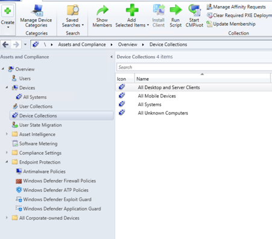

2. Right Click **Device Collection** and select **Create Device Collection**.

    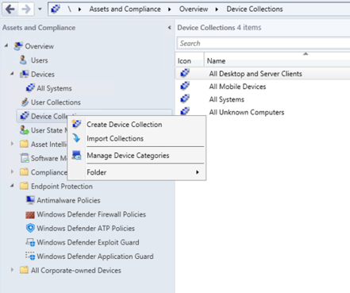

3. Provide a **Name** and **Limiting Collection**, then select **Next**.

    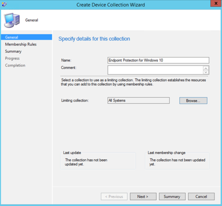

4. Select **Add Rule** and choose **Query Rule**.

    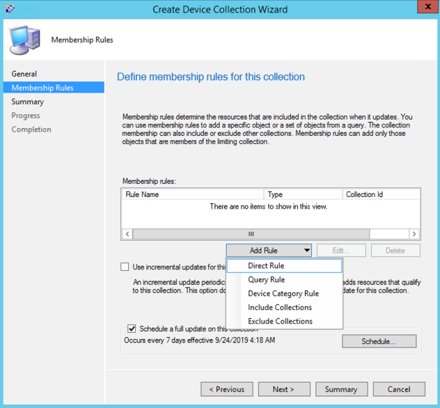

5.  Click **Next** on the **Direct Membership Wizard** and click on **Edit Query Statement**.

     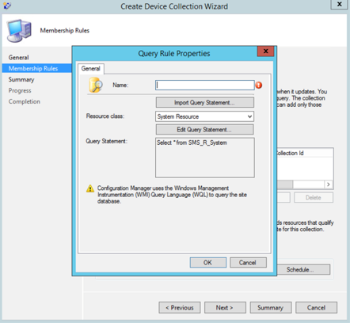

6. Select **Criteria** and then choose the star icon.

     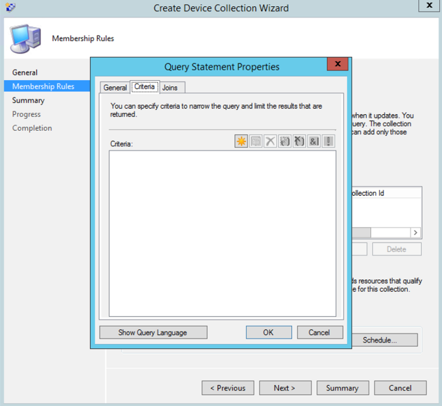

7. Keep criterion type as **simple value**, choose where as **Operating System - build number**, operator as **is equal to** and value **10240** and click on **OK**.

    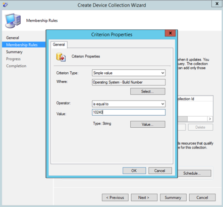

8. Select **Next** and **Close**.

    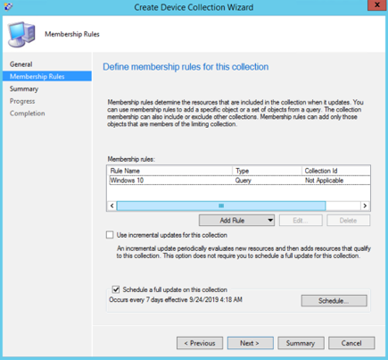

9. Select **Next**.

    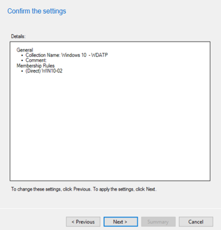

After completing this task, you now have a device collection with all the Windows 10 endpoints in the environment. 

## Endpoint detection and response
### Windows 10
From within the Microsoft Defender Security Center it is possible to download
the '.onboarding' policy that can be used to create the policy in System Center Configuration
Manager and deploy that policy to Windows 10 devices.

1. From a Microsoft Defender Security Center Portal, select [Settings and then Onboarding](https://securitycenter.windows.com/preferences2/onboarding).

2. Under Deployment method select the supported version of **Microsoft Endpoint Configuration Manager **.

    

3.	Select **Download package**.

    

4. Save the package to an accessible location.
5. In  Microsoft Endpoint Configuration Manager, navigate to: **Assets and Compliance > Overview > Endpoint Protection > Microsoft Defender ATP Policies**.

6. Right-click **Microsoft Defender ATP Policies** and select **Create Microsoft Defender ATP Policy**.

    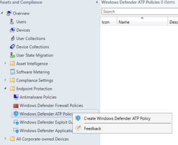

7. Enter the name and description, verify **Onboarding** is selected, then select **Next**.

    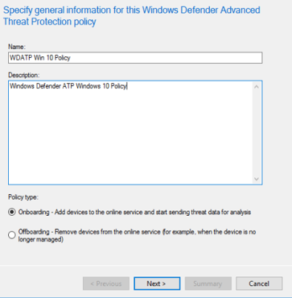

8. Click **Browse**.

9. Navigate to the location of the downloaded file from step 4 above.

    

10. Click **Next**.
11. Configure the Agent with the appropriate samples (**None** or **All file types**).

    

12. Select the appropriate telemetry (**Normal** or **Expedited**) then click **Next**.

    

14. Verify the configuration, then click **Next**.

     

15. Click **Close** when the Wizard completes.

16.  In the Microsoft Endpoint Configuration Manager console, right-click the Microsoft Defender ATP policy you just created and select **Deploy**.

     

17. On the right panel, select the previously created collection and click **OK**.

    

### Previous versions of Windows Client (Windows 7 and Windows 8.1)
Follow the steps below to identify the Microsoft Defender ATP Workspace ID and Workspace Key, that will be required for the onboarding of previous versions of Windows.

1. From a Microsoft Defender Security Center Portal, select **Settings > Onboarding**.

2. Under operating system choose **Windows 7 SP1 and 8.1**.

    

3. Copy the **Workspace ID** and **Workspace Key** and save them. They will be used later in the process.

Before the systems can be onboarded into the workspace, the deployment scripts need to be updated to contain the correct information. Failure to do so will result in the systems not being properly onboarded. Depending on the deployment method, this step may have already been completed.

Edit the InstallMMA.cmd with a text editor, such as notepad and update the
following lines and save the file:

   

Edit the ConfiguerOMSAgent.vbs with a text editor, such as notepad, and update the following lines and save the file:

   

Microsoft Monitoring Agent (MMA) is currently (as of January 2019) supported on the following Windows Operating
Systems:

-   Server SKUs: Windows Server 2008 SP1 or Newer

-   Client SKUs: Windows 7 SP1 and later

The MMA agent will need to be installed on Windows devices. To install the
agent, some systems will need to download the [Update for customer experience
and diagnostic
telemetry](https://support.microsoft.com/help/3080149/update-for-customer-experience-and-diagnostic-telemetry)
in order to collect the data with MMA. These system versions include but may not
be limited to:

-   Windows 8.1

-   Windows 7

-   Windows Server 2016

-   Windows Server 2012 R2

-   Windows Server 2008 R2

Specifically, for Windows 7 SP1, the following patches must be installed:

-   Install
    [KB4074598](https://support.microsoft.com/help/4074598/windows-7-update-kb4074598)

-   Install either [.NET Framework
    4.5](https://www.microsoft.com/en-us/download/details.aspx?id=30653) (or
    later) **or**
    [KB3154518](https://support.microsoft.com/help/3154518/support-for-tls-system-default-versions-included-in-the-net-framework).
    Do not install both on the same system.

To deploy the MMA with Microsoft Endpoint Configuration Manager, follow the steps
below to utilize the provided batch files to onboard the systems. The CMD file
when executed, will require the system to copy files from a network share by the
System, the System will install MMA, Install the DependencyAgent, and configure
MMA for enrollment into the workspace.

1. In  Microsoft Endpoint Configuration Manager console, navigate to **Software
    Library**.

2.  Expand **Application Management**.

3.  Right-click **Packages**  then select **Create Package**.

4. Provide a Name for the package, then click **Next**

    

5. Verify **Standard Program** is selected.

   

6.  Click **Next**.

    

7. Enter a program name.

8.  Browse to the location of the InstallMMA.cmd.

9.  Set Run to **Hidden**.

10.  Set **Program can run** to **Whether or not a user is logged on**.

11.  Click **Next**.

12.  Set the **Maximum allowed run time** to 720.

13.  Click **Next**.

   

14. Verify the configuration, then click **Next**.

    

15. Click **Next**.

16. Click **Close**.

17.  In the Microsoft Endpoint Configuration Manager console, right-click the Microsoft Defender ATP
    Onboarding Package just created and select **Deploy**.

18. On the right panel select the appropriate collection.

19.  Click **OK**.

## Next generation protection 
Microsoft Defender Antivirus is a built-in antimalware solution that provides next generation protection for desktops, portable computers, and servers.

1. In the Microsoft Endpoint Configuration Manager console, navigate to **Assets and Compliance \> Overview \> Endpoint Protection \> Antimalware Polices** and choose **Create Antimalware Policy**.

    

2. Select **Scheduled scans**, **Scan settings**, **Default actions**, **Real-time protection**, **Exclusion settings**, **Advanced**, **Threat overrides**, **Cloud Protection Service** and **Security intelligence   updates** and choose **OK**.

    

    In certain industries or some select enterprise customers might have specific
needs on how Antivirus is configured.

  
    [Quick scan versus full scan and custom scan](https://docs.microsoft.com/windows/security/threat-protection/windows-defender-antivirus/scheduled-catch-up-scans-windows-defender-antivirus#quick-scan-versus-full-scan-and-custom-scan)

    For more details, see [Windows Security configuration framework](https://docs.microsoft.com/windows/security/threat-protection/windows-security-configuration-framework/windows-security-configuration-framework)
  
    
    

    

    

    

    

    

    

    

3. Right-click on the newly created antimalware policy and select **Deploy** .

    

4. Target the new antimalware policy to your Windows 10 collection and click **OK**.

     

After completing this task, you now have successfully configured Windows
Defender Antivirus.

## Attack surface reduction
The attack surface reduction pillar of Microsoft Defender ATP includes the feature set that is available under Exploit Guard. Attack surface reduction (ASR) rules, Controlled Folder Access, Network Protection and Exploit
Protection. 

All these features provide an audit mode and a block mode. In audit mode there is no end-user impact. All it does is collect additional telemetry and make it available in the Microsoft Defender Security Center. The goal with a deployment is to step-by-step move security controls into block mode.

To set ASR rules in Audit mode:

1. In the Microsoft Endpoint Configuration Manager console, navigate to **Assets and Compliance \> Overview \> Endpoint Protection \> Windows Defender Exploit Guard** and choose **Create Exploit Guard Policy**.

   

2.  Select **Attack Surface Reduction**.
   

3. Set rules to **Audit** and click **Next**.

    

4. Confirm the new Exploit Guard policy by clicking on **Next**.

    

    
5. Once the policy is created click **Close**.

    

    

6.  Right-click on the newly created policy and choose **Deploy**.
    
    

7. Target the policy to the newly created Windows 10 collection and click **OK**.

    

After completing this task, you now have successfully configured ASR rules in audit mode.  
  
Below are additional steps to verify whether ASR rules are correctly applied to
endpoints. (This may take few minutes)

1. From a web browser, navigate to <https://securitycenter.windows.com>.

2.  Select **Configuration management** from left side menu.

    

3. Click **Go to attack surface management** in the Attack surface management panel. 
    
    

4. Click **Configuration** tab in Attack Surface reduction rules reports. It shows ASR rules configuration overview and ASR rules status on each devices.

    

5. Click each device shows configuration details of ASR rules.

    

See [Optimize ASR rule deployment and
detections](https://docs.microsoft.com/windows/security/threat-protection/microsoft-defender-atp/configure-machines-asr)   for more details.  

### To set Network Protection rules in Audit mode:
1. In the Microsoft Endpoint Configuration Manager console, navigate to **Assets and  Compliance \> Overview \> Endpoint Protection \> Windows Defender Exploit Guard** and choose **Create Exploit Guard Policy**.

    

2. Select **Network protection**.

3. Set the setting to **Audit** and click **Next**. 

    

4. Confirm the new Exploit Guard Policy by clicking **Next**.
    
    

5. Once the policy is created click on **Close**.

    

6. Right-click on the newly created policy and choose **Deploy**.

    

7. Select the policy to the newly created Windows 10 collection and choose **OK**.

    

After completing this task, you now have successfully configured Network
Protection in audit mode.

### To set Controlled Folder Access rules in Audit mode:

1. In the Microsoft Endpoint Configuration Manager console, navigate to **Assets and Compliance \> Overview \> Endpoint Protection \> Windows Defender Exploit Guard** and choose **Create Exploit Guard Policy**.

    

2. Select **Controlled folder access**.
    
3. Set the configuration to **Audit** and click **Next**.

        
    
4. Confirm the new Exploit Guard Policy by clicking on **Next**.

    

5. Once the policy is created click on **Close**.

    

6. Right-click on the newly created policy and choose **Deploy**.

    

7.  Target the policy to the newly created Windows 10 collection and click **OK**.

    

After completing this task, you now have successfully configured Controlled folder access in audit mode.

