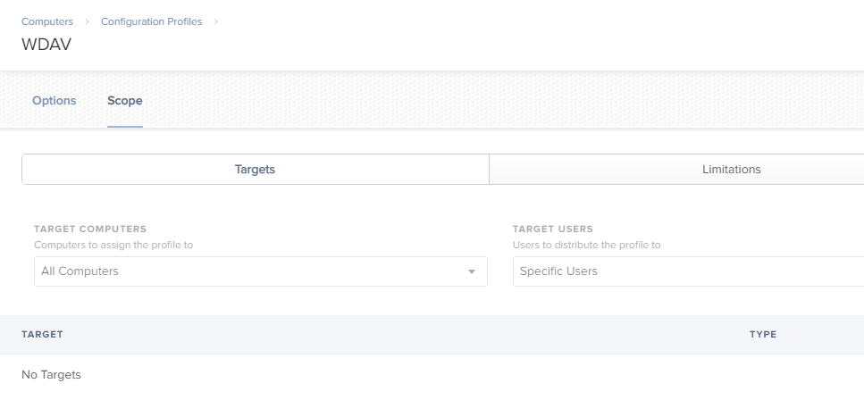
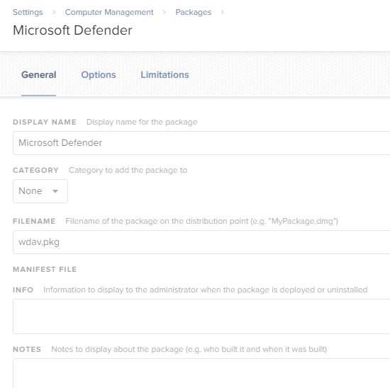
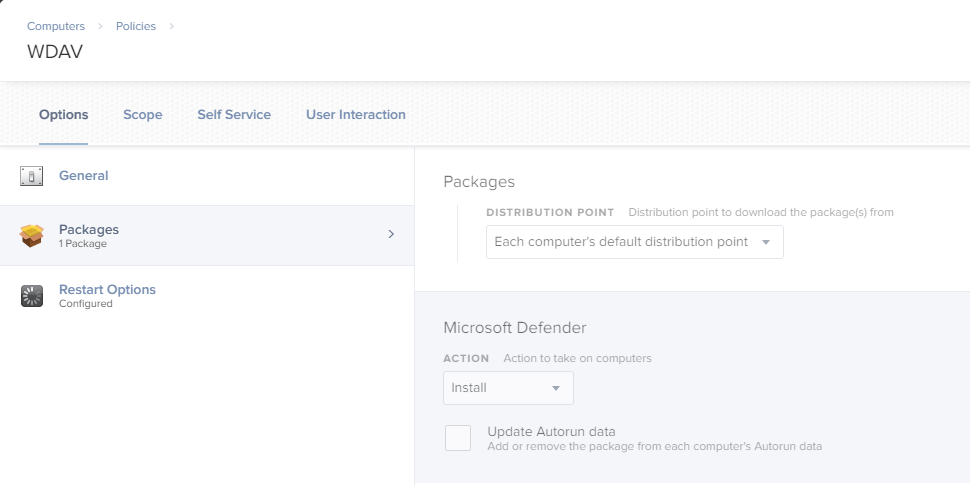
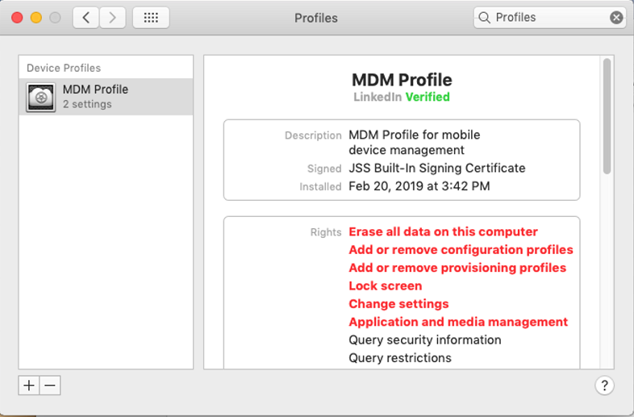

# JAMF-based deployment

**Applies to:**

[Windows Defender Advanced Threat Protection (Windows Defender ATP) for Mac](microsoft-defender-atp-mac.md)

>[!IMPORTANT]This topic relates to the pre-release version of Microsoft Defender ATP for Mac. Microsoft Defender ATP for Mac is not yet widely available, and this topic only applies to enterprise customers who have been accepted into the preview program. Microsoft makes no warranties, express or implied, with respect to the information provided here.

## Prerequisites and system requirements

Before you get started, please see [the main Microsoft Defender ATP for Mac page](microsoft-defender-atp-mac.md) for a description of prerequisites and system requirements for the current software version.

In addition, for JAMF deployment, you need to be familiar with JAMF administration tasks, have a JAMF tenant, and know how to deploy packages. This includes having a properly configured distribution point. JAMF has many ways to complete the same task. These instructions provide an example for most common processes. Your organization might use a different workflow.

## Download installation and onboarding packages

Download the installation and onboarding packages from Windows Defender Security Center:

1. In Windows Defender Security Center, go to **Settings > Machine Management > Onboarding**.
2. In Section 1 of the page, set operating system to **Linux, macOS, iOS or Android** and Deployment method to **Mobile Device Management / Microsoft Intune**.
3. In Section 2 of the page, select **Download installation package**. Save it as wdav.pkg to a local directory.
4. In Section 2 of the page, select **Download onboarding package**. Save it as WindowsDefenderATPOnboardingPackage.zip to the same directory.

    

5. From a command prompt, verify that you have the two files.
    Extract the contents of the .zip files:

    ```bash
    mavel-macmini:Downloads test$ ls -l
    total 721160
    -rw-r--r--  1 test  staff      11821 Mar 15 09:23 WindowsDefenderATPOnboardingPackage.zip
    -rw-r--r--  1 test  staff  354531845 Mar 13 08:57 wdav.pkg
    mavel-macmini:Downloads test$ unzip WindowsDefenderATPOnboardingPackage.zip
    Archive:  WindowsDefenderATPOnboardingPackage.zip
    warning:  WindowsDefenderATPOnboardingPackage.zip appears to use backslashes as path separators
    inflating: intune/kext.xml
     inflating: intune/WindowsDefenderATPOnboarding.xml
     inflating: jamf/WindowsDefenderATPOnboarding.plist
    mavel-macmini:Downloads test$
    ```

## Create JAMF Policies

You need to create a configuration profile and a policy to start deploying Microsoft Defender ATP for Mac to client machines.

### Configuration Profile

The configuration profile contains one custom settings payload that includes:

- Microsoft Defender ATP for Mac onboarding information
- Approved Kernel Extensions payload to enable the Microsoft kernel driver to run

1. Upload jamf/WindowsDefenderATPOnboarding.plist as the Property List File.

    >[!NOTE]
    > You must use exactly "com.microsoft.wdav.atp" as the Preference Domain.

    

### Approved Kernel Extension

To approve the kernel extension:

1. In **Computers > Configuration Profiles** select **Options > Approved Kernel Extensions**.
2. Use **UBF8T346G9** for Team Id.


#### Configuration Profile's Scope

Configure the appropriate scope to specify the machines that will receive this configuration profile.

Open Computers -> Configuration Profiles, select **Scope > Targets**. Select the appropriate Target computers.



Save the **Configuration Profile**.

Use the **Logs** tab to monitor deployment status for each enrolled machine.

### Package

1. Create a package in **Settings > Computer Management > Packages**.

    

2. Upload wdav.pkg to the Distribution Point.
3. In the **filename** field, enter the name of the package. For example, wdav.pkg.

### Policy

Your policy should contain a single package for Microsoft Defender.



Configure the appropriate scope to specify the computers that will receive this policy.

After you save the Configuration Profile, you can use the Logs tab to monitor the deployment status for each enrolled machine.

## Client machine setup

You need no special provisioning for a macOS computer beyond the standard JAMF Enrollment.

> [!NOTE]
> After a computer is enrolled, it will show up in the Computers inventory (All Computers).

1. Open the machine details, from **General** tab, and make sure that **User Approved MDM** is set to **Yes**. If it's set to No, the user needs to open **System Preferences > Profiles** and select **Approve** on the MDM Profile.




After some time, the machine's User Approved MDM status will change to Yes.


You can enroll additional machines now. Optionally, can do it after system configuration and application packages are provisioned.

## Deployment

Enrolled client machines periodically poll the JAMF Server and install new configuration profiles and policies as soon as they are detected.

### Status on server

You can monitor the deployment status in the Logs tab:

- **Pending** means that the deployment is scheduled but has not yet happened
- **Completed** means that the deployment succeeded and is no longer scheduled


### Status on client machine

After the Configuration Profile is deployed, you'll see the profile on the machine in the **System Preferences > Profiles >** Name of Configuration Profile.


After the policy is applied, you'll see the Microsoft Defender icon in the macOS status bar in the top-right corner.


You can monitor policy installation on a machine by following the JAMF's log file:

```bash
    mavel-mojave:~ testuser$ tail -f /var/log/jamf.log
    Thu Feb 21 11:11:41 mavel-mojave jamf[7960]: No patch policies were found.
    Thu Feb 21 11:16:41 mavel-mojave jamf[8051]: Checking for policies triggered by "recurring check-in" for user "testuser"...
    Thu Feb 21 11:16:43 mavel-mojave jamf[8051]: Executing Policy WDAV
    Thu Feb 21 11:17:02 mavel-mojave jamf[8051]: Installing Microsoft Defender...
    Thu Feb 21 11:17:23 mavel-mojave jamf[8051]: Successfully installed Microsoft Defender.
    Thu Feb 21 11:17:23 mavel-mojave jamf[8051]: Checking for patches...
    Thu Feb 21 11:17:23 mavel-mojave jamf[8051]: No patch policies were found.
```

You can also check the onboarding status:

```bash
    mavel-mojave:~ testuser$ sudo /Library/Extensions/wdavkext.kext/Contents/Resources/Tools/wdavconfig.py
    uuid            : 69EDB575-22E1-53E1-83B8-2E1AB1E410A6
    orgid           : 79109c9d-83bb-4f3e-9152-8d75ee59ae22
    orgid managed   : 79109c9d-83bb-4f3e-9152-8d75ee59ae22
    orgid effective : 79109c9d-83bb-4f3e-9152-8d75ee59ae22
```

- **orgid/orgid managed**: This is the Microsoft Defender ATP org id specified in the configuration profile. If this value is blank, then the Configuration Profile was not properly set.

- **orgid effective**: This is the Microsoft Defender ATP org id currently in use. If it does not match the value in the Configuration Profile, then the configuration has not been refreshed.

## Check onboarding status

You can check that machines are correctly onboarded by creating a script. For example, the following script checks that enrolled machines are onboarded:

```bash
    sudo /Library/Extensions/wdavkext.kext/Contents/Resources/Tools/wdavconfig.py | grep -E 'orgid effective : [-a-zA-Z0-9]+'
```

This script returns 0 if Microsoft Defender ATP is registered with the Windows Defender ATP service, and another exit code if it is not installed or registered.

## Logging installation issues

See [Logging installation issues](microsoft-defender-atp-mac-resources.md#logging-installation-issues) for more information on how to find the automatically generated log that is created by the installer when an error occurs.

## Uninstallation

See [Uninstalling](microsoft-defender-atp-mac-resources.md#uninstalling) for details on how to remove Windows Defender ATP for Mac from client devices.