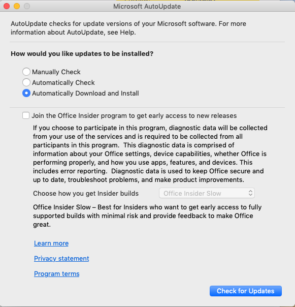

# Resources

**Applies to:**

[Microsoft Defender Advanced Threat Protection (Microsoft Defender ATP) for Mac](microsoft-defender-atp-mac.md)

>[!IMPORTANT]
>This topic relates to the pre-release version of Microsoft Defender ATP for Mac. Microsoft Defender ATP for Mac is not yet widely available. Microsoft makes no warranties, express or implied, with respect to the information provided here.

## Collecting diagnostic information

If you can reproduce a problem, please increase the logging level, run the system for some time, and restore the logging level to the default.

1. Increase logging level:

   ```bash
   mavel-mojave:~ testuser$ mdatp --log-level verbose
   Creating connection to daemon
   Connection established
   Operation succeeded
   ```

2. Reproduce the problem

3. Run `mdatp --diagnostic --create` to backup Microsoft Defender ATP's logs. The command will print out location with generated zip file.

   ```bash
   mavel-mojave:~ testuser$ mdatp --diagnostic --create
   Creating connection to daemon
   Connection established
   "/Library/Application Support/Microsoft/Defender/wdavdiag/d85e7032-adf8-434a-95aa-ad1d450b9a2f.zip"
   ```

4. Restore logging level:

   ```bash
   mavel-mojave:~ testuser$ mdatp --log-level info
   Creating connection to daemon
   Connection established
   Operation succeeded
   ```

## Logging installation issues

If an error occurs during installation, the installer will only report a general failure.

The detailed log will be saved to /Library/Logs/Microsoft/wdav.install.log. If you experience issues during installation, send us this file so we can help diagnose the cause.

## Upgrade

We distribute our updates via Microsoft Auto Update (MAU). You can check for MAU settings in main application's menu (Help => Check For Product Updates...):

    

**Q**: Can MDATP for Mac be updated without MAU?

**A**: In the current release, MDATP for Mac product updates are done via Microsoft Auto Update (MAU). While advanced manageability experts may be able to set up the product updates without MAU, this scenario is not explicitly supported. We will monitor customer interest in this scenario to evaluate its importance relative to other product advancements.

## Uninstalling

There are several ways to uninstall Microsoft Defender ATP for Mac. Please note that while centrally managed uninstall is available on JAMF, it is not yet available for Microsoft Intune.

### Within the GUI

- Open **Finder > Applications**. Right click on **Microsoft Defender ATP > Move to Trash**.

### From the command line

- ```sudo rm -rf '/Applications/Microsoft Defender ATP'```

## Configuring from the command line

Important tasks, such as controlling product settings and triggering on-demand scans, can be done from the command line:

|Group        |Scenario                                   |Command                                                                |
|-------------|-------------------------------------------|-----------------------------------------------------------------------|
|Configuration|Turn on/off real-time protection           |`mdatp --config rtp [true/false]`                                      |
|Configuration|Turn on/off cloud protection               |`mdatp --config cloud [true/false]`                                    |
|Configuration|Turn on/off product diagnostics            |`mdatp --config diagnostic [true/false]`                               |
|Configuration|Turn on/off automatic sample submission    |`mdatp --config sample-submission [true/false]`                        |
|Configuration|Turn on PUA protection                     |`mdatp --threat --type-handling potentially_unwanted_application block`|
|Configuration|Turn off PUA protection                    |`mdatp --threat --type-handling potentially_unwanted_application off`  |
|Configuration|Turn on audit mode for PUA protection      |`mdatp --threat --type-handling potentially_unwanted_application audit`|
|Diagnostics  |Change the log level                       |`mdatp --log-level [error/warning/info/verbose]`                       |
|Diagnostics  |Generate diagnostic logs                   |`mdatp --diagnostic --create`                                          |
|Health       |Check the product's health                 |`mdatp --health`                                                       |
|Protection   |Scan a path                                |`mdatp --scan --path [path]`                                           |
|Protection   |Do a quick scan                            |`mdatp --scan --quick`                                                 |
|Protection   |Do a full scan                             |`mdatp --scan --full`                                                  |
|Protection   |Cancel an ongoing on-demand scan           |`mdatp --scan --cancel`                                                |
|Protection   |Request a definition update                |`mdatp --definition-update`                                            |

## Microsoft Defender ATP portal information

In the Microsoft Defender ATP portal, you'll see two categories of information:

- AV alerts, including:
  - Severity
  - Scan type
  - Device information (hostname, machine identifier, tenant identifier, app version, and OS type)
  - File information (name, path, size, and hash)
  - Threat information (name, type, and state)
- Device information, including:
  - Machine identifier
  - Tenant identifier
  - App version
  - Hostname
  - OS type
  - OS version
  - Computer model
  - Processor architecture
  - Whether the device is a virtual machine

## Known issues

- Not fully optimized for performance or disk space yet.
- Full Microsoft Defender ATP integration is not available yet.
- Mac devices that switch networks may appear multiple times in the Microsoft Defender ATP portal.
- Centrally managed uninstall via Intune is still in development. As an alternative, manually uninstall Microsoft Defender ATP for Mac from each client device.
