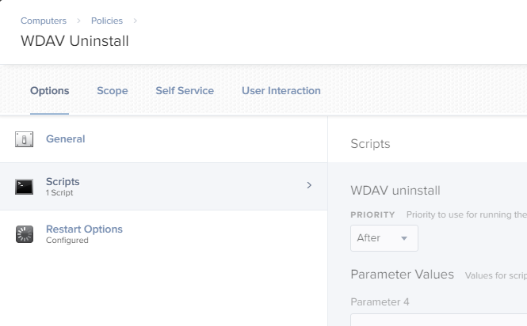

## Collecting diagnostic information

**Applies to:**

[Windows Defender Advanced Threat Protection (Windows Defender ATP) for Mac](https://go.microsoft.com/fwlink/p/?linkid=???To-Add???)
 
>[!IMPORTANT]
>Some information relates to prereleased product which may be substantially modified before it's commercially released. Microsoft makes no warranties, express or implied, with respect to the information provided here.

If you can reproduce a problem, please increase the logging level, run the system for some time, and restore the logging level to the default.

1) Increase logging level:

```bash
   mavel-mojave:~ testuser$ mdatp log-level --verbose
   Creating connection to daemon
   Connection established
   Operation succeeded
```

2) Reproduce the problem

3) Run `mdatp --diagnostic` to backup Defender ATP's logs. The command will print out location with generated zip file.

   ```bash
   mavel-mojave:~ testuser$ mdatp --diagnostic
   Creating connection to daemon
   Connection established
   "/Library/Application Support/Microsoft/Defender/wdavdiag/d85e7032-adf8-434a-95aa-ad1d450b9a2f.zip"
   ```

4) Restore logging level:

   ```bash
   mavel-mojave:~ testuser$ mdatp log-level --info
   Creating connection to daemon
   Connection established
   Operation succeeded
   ```

### Installation issues

If an error occurs during installation, the installer will only report a general failure.

The detailed log will be saved to /Library/Logs/Microsoft/wdav.install.log. If you experience issues during installation, send us this file so we can help diagnose the cause.

## Uninstalling

There are several ways to uninstall Microsoft Defender ATP for Mac. Please note that while centrally managed uninstall is available for JAMF, it is not yet available for Intune. 

### Within the GUI

- Open **Finder > Applications**. Right click on **Microsoft Defender ATP > Move to Trash**.

### From the command line:

- ```sudo rm -rf '/Applications/Microsoft Defender ATP'```

### With a script

Create a script in **Settings > Computer Management > Scripts**.


For example, this script removes Microsoft Defender ATP from the /Applications directory:

```bash
   echo "Is WDAV installed?"
   ls -ld '/Applications/Microsoft Defender ATP.app' 2>/dev/null

   echo "Uninstalling WDAV..."
   rm -rf '/Applications/Microsoft Defender ATP.app'

   echo "Is WDAV still installed?"
   ls -ld '/Applications/Microsoft Defender ATP.app' 2>/dev/null

   echo "Done!"
```

### With a JAMF policy

If you are running JAMF, your policy should contain a single script:



Configure the appropriate scope in the **Scope** tab to specify the machines that will receive this policy.

## Known issues

- Not fully optimized for performance or disk space yet.
- Full Windows Defender ATP integration is not available yet.
- Mac devices that switch networks may appear multiple times in the APT portal.
- Centrally managed uninstall via Intune is still in development. As an alternative, manually uninstall Microsoft Defender ATP for Mac from each client device.