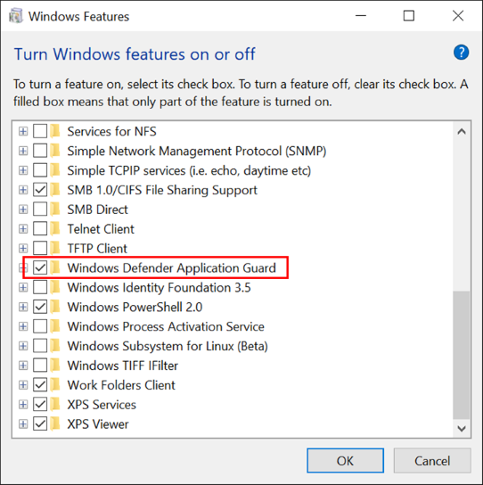

# Prepare to install Windows Defender Application Guard

**Applies to:**
- [Microsoft Defender Advanced Threat Protection (Microsoft Defender ATP)](https://go.microsoft.com/fwlink/p/?linkid=2069559)

## Review system requirements
 
See [System requirements for Windows Defender Application Guard](https://docs.microsoft.com/windows/security/threat-protection/windows-defender-application-guard/reqs-wd-app-guard) to review the hardware and software installation requirements for Windows Defender Application Guard.
>[!NOTE]
>Windows Defender Application Guard is not supported on VMs and VDI environment. For testing and automation on non-production machines, you may enable WDAG on a VM by enabling Hyper-V nested virtualization on the host.

## Prepare for Windows Defender Application Guard 
Before you can install and use Windows Defender Application Guard, you must determine which way you intend to use it in your enterprise. You can use Application Guard in either **Standalone** or **Enterprise-managed** mode.

### Standalone mode

Applies to:
- Windows 10 Enterprise edition, version 1709 or higher
- Windows 10 Pro edition, version 1803

Employees can use hardware-isolated browsing sessions without any administrator or management policy configuration. In this mode,   you must install Application Guard and then the employee must manually start Microsoft Edge in Application Guard while browsing untrusted sites. For an example of how this works, see the [Application Guard in standalone mode](test-scenarios-wd-app-guard.md) testing scenario.

## Enterprise-managed mode

Applies to:
- Windows 10 Enterprise edition, version 1709 or higher

You and your security department can define your corporate boundaries by explicitly adding trusted domains and by customizing the Application Guard experience to meet and enforce your needs on employee devices. Enterprise-managed mode also automatically redirects any browser requests to add non-enterprise domain(s) in the container.

The following diagram shows the flow between the host PC and the isolated container.


## Install Application Guard

Application Guard functionality is turned off by default. However, you can quickly install it on your employee's devices through the Control Panel, PowerShell, or your mobile device management (MDM) solution.

### To install by using the Control Panel

1. Open the **Control Panel**, click **Programs,** and then click **Turn Windows features on or off**.

    

2. Select the check box next to **Windows Defender Application Guard** and then click **OK**.

   Application Guard and its underlying dependencies are all installed.

### To install by using PowerShell

>[!NOTE]
>Ensure your devices have met all system requirements prior to this step. PowerShell will install the feature without checking system requirements. If your devices don't meet the system requirements, Application Guard may not work. This step is recommended for enterprise managed scenarios only.

1. Click the **Search** or **Cortana** icon in the Windows 10 taskbar and type **PowerShell**.
   
2. Right-click **Windows PowerShell**, and then click **Run as administrator**.

   Windows PowerShell opens with administrator credentials.

3. Type the following command:

    ```
    Enable-WindowsOptionalFeature -online -FeatureName Windows-Defender-ApplicationGuard
    ```
4. Restart the device.

   Application Guard and its underlying dependencies are all installed.

### To install by using Intune

> [!IMPORTANT]
> Make sure your organization's devices are [enrolled in Intune](https://docs.microsoft.com/mem/intune/enrollment/device-enrollment).


1. Go to [https://endpoint.microsoft.com](https://endpoint.microsoft.com) and sign in.

2. Choose **Devices** > **Configuration profiles** > **+ Create profile**, and do the following: <br/>

   a. In the **Platform** list, select **Windows 10 and later**. 
   
   b. In the **Profile** list, select **Endpoint protection**. 
   
   c. Choose **Create**.

4. Specify the following settings for the profile:

   - **Name** and **Description**

   - In the **Select a category to configure settings** section, choose **Microsoft Defender Application Guard**.

   - In the **Application Guard** list, choose **Enabled for Edge**.

   - Choose your preferences for **Clipboard behavior**, **External content**, and the remaining settings.

5. Choose **OK**, and then choose **OK** again.

6. Review your settings, and then choose **Create**.

7. Choose **Assignments**, and then do the following:

   a. On the **Include** tab, in the **Assign to** list, choose an option.

   b. If you have any devices or users you want to exclude from this endpoint protection profile, specify those on the **Exclude** tab.

   c. Click **Save**.

After the profile is created, any devices to which the policy should apply will have Windows Defender Application Guard enabled. Users might have to restart their devices in order for protection to be in place.