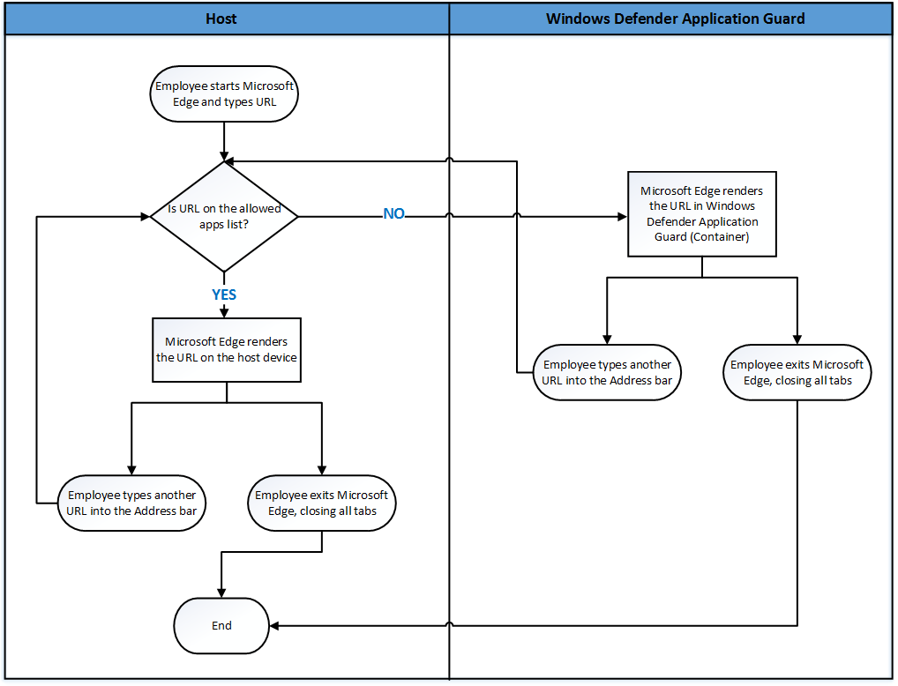

# Enable hardware-based isolation for Microsoft Edge

**Applies to:**
- Windows Defender Advanced Threat Protection (Windows Defender ATP)

## Review system requirements

>[!NOTE]
>Windows Defender Application Guard is not supported on VMs and VDI environment. For testing and automation on non-production machines, you may enable WDAG on a VM by enabling Hyper-V nested virtualization on the host.

### Hardware requirements
Your environment needs the following hardware to run Windows Defender Application Guard.

|Hardware|Description|
|--------|-----------|
|64-bit CPU|A 64-bit computer with minimum 4 cores is required for hypervisor and virtualization-based security (VBS). For more info about Hyper-V, see [Hyper-V on Windows Server 2016](https://docs.microsoft.com/en-us/windows-server/virtualization/hyper-v/hyper-v-on-windows-server) or [Introduction to Hyper-V on Windows 10](https://docs.microsoft.com/en-us/virtualization/hyper-v-on-windows/about/). For more info about hypervisor, see [Hypervisor Specifications](https://docs.microsoft.com/en-us/virtualization/hyper-v-on-windows/reference/tlfs).|
|CPU virtualization extensions|Extended page tables, also called _Second Level Address Translation (SLAT)_<br><br>**-AND-**<br><br>One of the following virtualization extensions for VBS:<br><br>VT-x (Intel)<br><br>**-OR-**<br><br>AMD-V|
|Hardware memory|Microsoft requires a minimum of 8GB RAM|
|Hard disk|5 GB free space, solid state disk (SSD) recommended|
|Input/Output Memory Management Unit (IOMMU) support|Not required, but strongly recommended|

### Software requirements
Your environment needs the following software to run Windows Defender Application Guard.

|Software|Description|
|--------|-----------|
|Operating system|Windows 10 Enterprise edition, version 1709 or higher<br>Windows 10 Professional edition, version 1803|
|Browser|Microsoft Edge and Internet Explorer|
|Management system<br> (only for managed devices)|[Microsoft Intune](https://docs.microsoft.com/en-us/intune/)<br><br>**-OR-**<br><br>[System Center Configuration Manager](https://docs.microsoft.com/en-us/sccm/)<br><br>**-OR-**<br><br>[Group Policy](https://technet.microsoft.com/en-us/library/cc753298(v=ws.11).aspx)<br><br>**-OR-**<br><br>Your current company-wide 3rd party mobile device management (MDM) solution. For info about 3rd party MDM solutions, see the documentation that came with your product.|


## Prepare for Windows Defender Application Guard 
Before you can install and use Windows Defender Application Guard, you must determine which way you intend to use it in your enterprise. You can use Application Guard in either **Standalone** or **Enterprise-managed** mode.

**Standalone mode**

Applies to:
- Windows 10 Enterprise edition, version 1709 or higher
- Windows 10 Professional edition, version 1803

Employees can use hardware-isolated browsing sessions without any administrator or management policy configuration. In this mode,   you must install Application Guard and then the employee must manually start Microsoft Edge in Application Guard while browsing untrusted sites. For an example of how this works, see the [Application Guard in standalone mode](test-scenarios-wd-app-guard.md) testing scenario.

**Enterprise-managed mode** 

Applies to:
- Windows 10 Enterprise edition, version 1709 or higher

You and your security department can define your corporate boundaries by explicitly adding trusted domains and by customizing the Application Guard experience to meet and enforce your needs on employee devices. Enterprise-managed mode also automatically redirects any browser requests tooad non-enterprise domain(s) in the container.

The following diagram shows the flow between the host PC and the isolated container.


## Install Application Guard
Application Guard functionality is turned off by default. However, you can quickly install it on your employee’s devices through the Control Panel, PowerShell, or your mobile device management (MDM) solution.

**To install by using the Control Panel**
1. Open the **Control Panel**, click **Programs,** and then click **Turn Windows features on or off**.

    

2. Select the check box next to **Windows Defender Application Guard** and then click **OK**.

   Application Guard and its underlying dependencies are all installed.

**To install by using PowerShell**
1. Click the **Search** or **Cortana** icon in the Windows 10 taskbar and type **PowerShell**.
   
2. Right-click **Windows PowerShell**, and then click **Run as administrator**.

   Windows PowerShell opens with administrator credentials.

3. Type the following command:

    ```
    Enable-WindowsOptionalFeature -online -FeatureName Windows-Defender-ApplicationGuard
    ```
4. Restart the device.

   Application Guard and its underlying dependencies are all installed.

