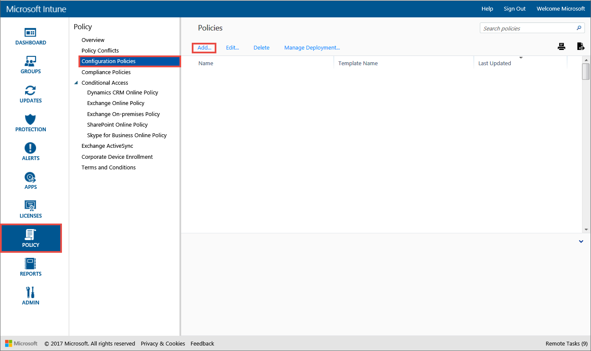
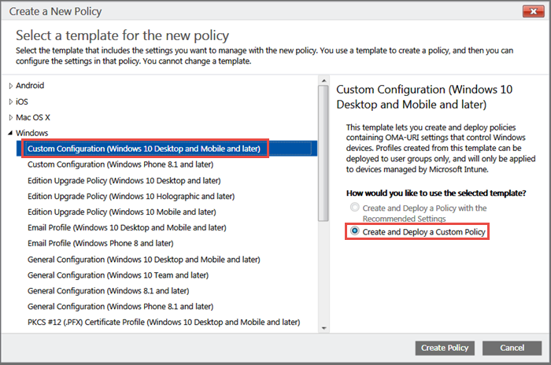
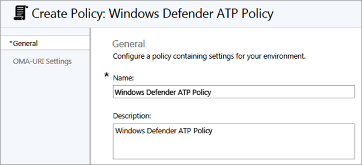
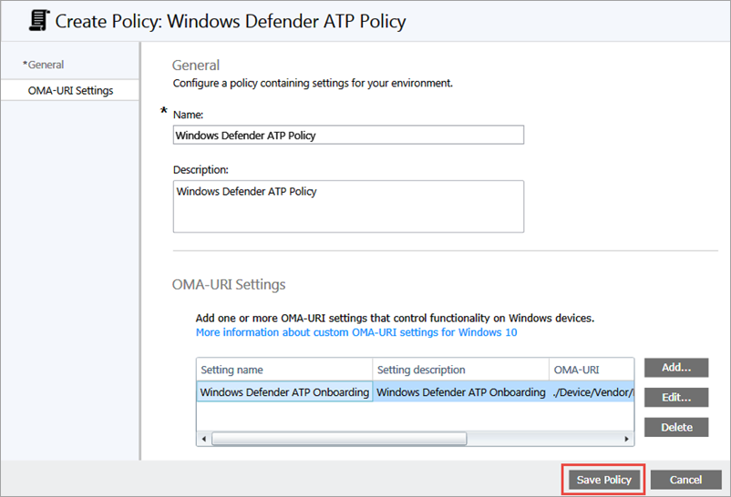
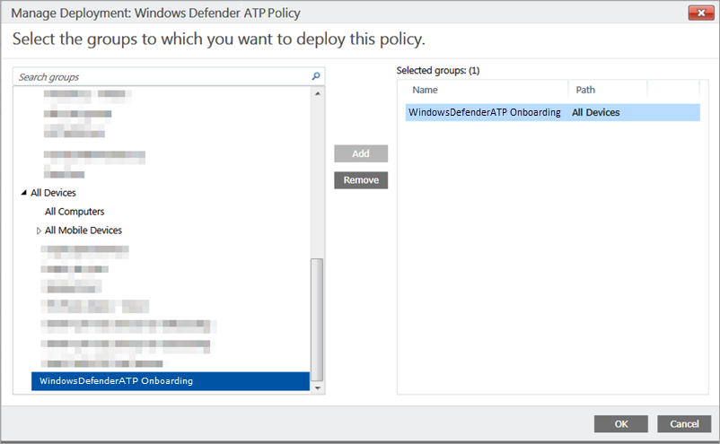

# Configure endpoints using Mobile Device Management tools

**Applies to:**

- Windows 10 Enterprise
- Windows 10 Education
- Windows 10 Pro
- Windows 10 Pro Education
- Windows Defender Advanced Threat Protection (Windows Defender ATP)

>Want to experience Windows Defender ATP? [Sign up for a free trial.](https://www.microsoft.com/en-us/WindowsForBusiness/windows-atp?ocid=docs-wdatp-configureendpointsmdm-abovefoldlink)

You can use mobile device management (MDM) solutions to configure endpoints. Windows Defender ATP supports MDMs by providing OMA-URIs to create policies to manage endpoints.

For more information on using Windows Defender ATP CSP see, [WindowsAdvancedThreatProtection CSP](https://msdn.microsoft.com/library/windows/hardware/mt723296(v=vs.85).aspx) and [WindowsAdvancedThreatProtection DDF file](https://msdn.microsoft.com/library/windows/hardware/mt723297(v=vs.85).aspx).

## Before you begin
If you're using Microsoft Intune, you must have the device MDM Enrolled. Otherwise, settings will not be applied successfully. 

For more information on enabling MDM with Microsoft Intune, see [Setup Windows Device Management](https://docs.microsoft.com/intune-classic/deploy-use/set-up-windows-device-management-with-microsoft-intune).

## Configure endpoints using Microsoft Intune

For more information on using Windows Defender ATP CSP see, [WindowsAdvancedThreatProtection CSP](https://msdn.microsoft.com/library/windows/hardware/mt723296(v=vs.85).aspx) and [WindowsAdvancedThreatProtection DDF file](https://msdn.microsoft.com/library/windows/hardware/mt723297(v=vs.85).aspx).

### Onboard and monitor endpoints using the classic Intune console

1. Open the Microsoft Intune configuration package .zip file (*WindowsDefenderATPOnboardingPackage.zip*) that you downloaded from the service onboarding wizard. You can also get the package from the [Windows Defender ATP portal](https://securitycenter.windows.com/):

    a.  Select **Endpoint management** > **Clients** on the **Navigation pane**.

    b.  Select **Mobile Device Management/Microsoft Intune** > **Download package** and save the .zip file.

      

2. Extract the contents of the .zip file to a shared, read-only location that can be accessed by the network administrators who will deploy the package. You should have a file named  *WindowsDefenderATP.onboarding*.

3. Use the Microsoft Intune custom configuration policy to deploy the following supported OMA-URI settings. For more information on Microsoft Intune policy settings see, [Windows 10 policy settings in Microsoft Intune](https://docs.microsoft.com/en-us/intune/deploy-use/windows-10-policy-settings-in-microsoft-intune).

  a. Select **Policy** > **Configuration Policies** > **Add**.
  

  b. Under **Windows**, select **Custom Configuration (Windows 10 Desktop and Mobile and later)** > **Create and Deploy a Custom Policy** > **Create Policy**.  
  

  c. Type a name and description for the policy.  

  

  d. Under OMA-URI settings, select **Add...**.  

  

  e. Type the following values then select **OK**:

  

  - **Setting name**: Type a name for the setting.
  - **Setting description**: Type a description for the setting.
  - **Data type**: Select **String**.
  - **OMA-URI**:  *./Device/Vendor/MSFT/WindowsAdvancedThreatProtection/Onboarding*
  - **Value**: Copy and paste the contents of the *WindowsDefenderATP.onboarding* file you downloaded.

  f. Save the policy.

  

  g. Deploy the policy.

  

  h. Select the device group to deploy the policy to:

  

When the policy is deployed and is propagated, endpoints will be shown in the **Machines list**.

You can use the following onboarding policies to deploy configuration settings on endpoints. These policies can be sub-categorized to:
- Onboarding
- Health Status for onboarded machines
- Configuration for onboarded machines

> [!div class="mx-tableFixed"]
Policy | OMA-URI | Type | Value | Description
:---|:---|:---|:---|:---
Onboarding | ./Device/Vendor/MSFT/WindowsAdvancedThreatProtection/Onboarding | String | Copy content from onboarding MDM file |  Onboarding
Health Status for onboarded machines: Sense Is Running | ./Device/Vendor/MSFT/WindowsAdvancedThreatProtection/HealthState/SenseIsRunning | Boolean | TRUE |  Windows Defender ATP service is running
Health Status for onboarded machines: Onboarding State | ./Device/Vendor/MSFT/WindowsAdvancedThreatProtection/HealthState/OnBoardingState | Integer | 1 | Onboarded to Windows Defender ATP
Health Status for onboarded machines: Organization ID | ./Device/Vendor/MSFT/WindowsAdvancedThreatProtection/HealthState/OrgId | String | Use OrgID from onboarding file | Onboarded to Organization ID
Configuration for onboarded machines  | ./Device/Vendor/MSFT/WindowsAdvancedThreatProtection/Configuration/SampleSharing | Integer | 0 or 1   Default value: 1 | Windows Defender ATP Sample sharing is enabled
Configuration for onboarded machines: diagnostic data reporting frequency | ./Device/Vendor/MSFT/WindowsAdvancedThreatProtection/Configuration/TelemetryReportingFrequency | Integer | 1 or 2   1: Normal (default)   2: Expedite | Windows Defender ATP diagnostic data reporting

> [!NOTE]
> - The **Health Status for onboarded machines** policy uses read-only properties and can't be remediated.
> - Configuration of diagnostic data reporting frequency is only available for machines on Windows 10, version 1703.
> - Using the Expedite mode might have an impact on the machine's battery usage and actual bandwidth used for sensor data. You should consider this when these measures are critical.

>[!TIP]
> After onboarding the endpoint, you can choose to run a detection test to verify that an endpoint is properly onboarded to the service. For more information, see [Run a detection test on a newly onboarded Windows Defender ATP endpoint](run-detection-test-windows-defender-advanced-threat-protection.md).

### Offboard and monitor endpoints

For security reasons, the package used to offboard endpoints will expire 30 days after the date it was downloaded. Expired offboarding packages sent to an endpoint will be rejected. When downloading an offboarding package you will be notified of the packages expiry date and it will also be included in the package name.

> [!NOTE]
> Onboarding and offboarding policies must not be deployed on the same endpoint at the same time, otherwise this will cause unpredictable collisions.

1.	Get the offboarding package from the [Windows Defender ATP portal](https://securitycenter.windows.com/):

    a. Click **Endpoint management** > **Clients** on the **Navigation pane**.

    b. Click the **Endpoint offboarding** section.

    c. Select **Mobile Device Management /Microsoft Intune**, click **Download package** and save the .zip file.

2.	Extract the contents of the .zip file to a shared, read-only location that can be accessed by the network administrators who will deploy the package. You should have a file named *WindowsDefenderATP_valid_until_YYYY-MM-DD.offboarding*.

3. Use the Microsoft Intune custom configuration policy to deploy the following supported OMA-URI settings. For more information on Microsoft Intune policy settings see, [Windows 10 policy settings in Microsoft Intune](https://docs.microsoft.com/en-us/intune/deploy-use/windows-10-policy-settings-in-microsoft-intune).

Offboarding - Use the offboarding policies to remove configuration settings on endpoints. These policies can be sub-categorized to:
- Offboarding
- Health Status for offboarded machines
- Configuration for offboarded machines

Policy | OMA-URI | Type | Value | Description
:---|:---|:---|:---|:---
Offboarding | ./Device/Vendor/MSFT/WindowsAdvancedThreatProtection/Offboarding | String | Copy content from offboarding MDM file | Offboarding
 Health Status for offboarded machines: Sense Is Running | ./Device/Vendor/MSFT/WindowsAdvancedThreatProtection/HealthState/SenseIsRunning | Boolean | FALSE |Windows Defender ATP service is not running
Health Status for offboarded machines: Onboarding State | ./Device/Vendor/MSFT/WindowsAdvancedThreatProtection/HealthState/OnBoardingState | Integer | 0 | Offboarded from Windows Defender ATP

> [!NOTE]
> The **Health Status for offboarded machines** policy uses read-only properties and can't be remediated.

> [!IMPORTANT]
> Offboarding causes the machine to stop sending sensor data to the portal but data from the machine, including reference to any alerts it has had will be retained for up to 6 months.

## Related topics
- [Configure endpoints using Group Policy](configure-endpoints-gp-windows-defender-advanced-threat-protection.md)
- [Configure endpoints using System Center Configuration Manager](configure-endpoints-sccm-windows-defender-advanced-threat-protection.md)
- [Configure endpoints using a local script](configure-endpoints-script-windows-defender-advanced-threat-protection.md)
- [Configure non-persistent virtual desktop infrastructure (VDI) machines](configure-endpoints-vdi-windows-defender-advanced-threat-protection.md)
- [Run a detection test on a newly onboarded Windows Defender ATP endpoint](run-detection-test-windows-defender-advanced-threat-protection.md)
- [Troubleshoot Windows Defender Advanced Threat Protection onboarding issues](troubleshoot-onboarding-windows-defender-advanced-threat-protection.md)
