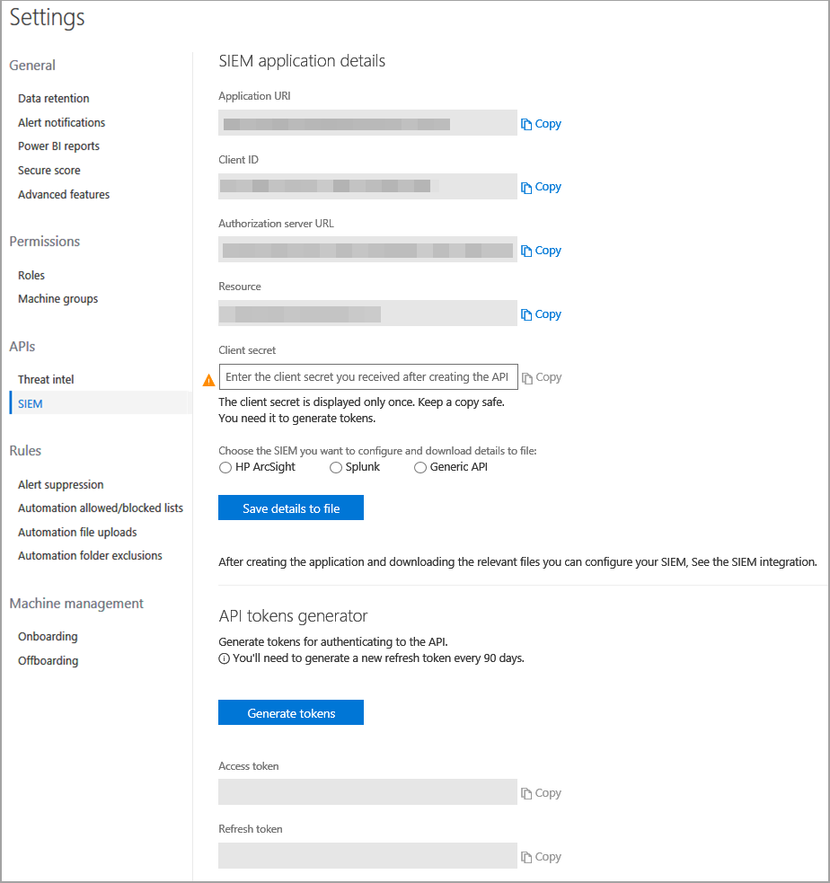

# Enable SIEM integration in Windows Defender ATP

**Applies to:**

- Windows Defender Advanced Threat Protection (Windows Defender ATP)

>Want to experience Windows Defender ATP? [Sign up for a free trial.](https://www.microsoft.com/en-us/WindowsForBusiness/windows-atp?ocid=docs-wdatp-enablesiem-abovefoldlink) 

Enable security information and event management (SIEM) integration so you can pull alerts from Windows Defender Security Center using your SIEM solution or by connecting directly to the alerts REST API.

1. In the navigation pane, select **Settings** > **SIEM**.

  

2. Select **Enable SIEM integration**. This activates the **SIEM connector access details** section with pre-populated values and an application is created under you Azure Active Directory (AAD) tenant.

  > [!WARNING]
  >The client secret is only displayed once. Make sure you keep a copy of it in a safe place. 
  For more information about getting a new secret see, [Learn how to get a new secret](troubleshoot-custom-ti-windows-defender-advanced-threat-protection.md#learn-how-to-get-a-new-client-secret).

3. Choose the SIEM type you use in your organization.

  > [!NOTE]
  > If you select HP ArcSight, you'll need to save these two configuration files: 
  - WDATP-connector.jsonparser.properties
  - WDATP-connector.properties  

  If you want to connect directly to the alerts REST API through programmatic access, choose **Generic API**.

4. Copy the individual values or select **Save details to file** to download a file that contains all the values.

5. Select **Generate tokens** to get an access and refresh token.
  
  > [!NOTE]
  > You'll need to generate a new Refresh token every 90 days. 

You can now proceed with configuring your SIEM solution or connecting to the alerts REST API through programmatic access. You'll need to use the tokens when configuring your SIEM solution to allow it to receive alerts from Windows Defender Security Center.

## Related topics
- [Configure Splunk to pull Windows Defender ATP alerts](configure-splunk-windows-defender-advanced-threat-protection.md)
- [Configure HP ArcSight to pull Windows Defender ATP alerts](configure-arcsight-windows-defender-advanced-threat-protection.md)
- [Windows Defender ATP alert API fields](api-portal-mapping-windows-defender-advanced-threat-protection.md)
- [Pull Windows Defender ATP alerts using REST API](pull-alerts-using-rest-api-windows-defender-advanced-threat-protection.md)
- [Troubleshoot SIEM tool integration issues](troubleshoot-siem-windows-defender-advanced-threat-protection.md)
