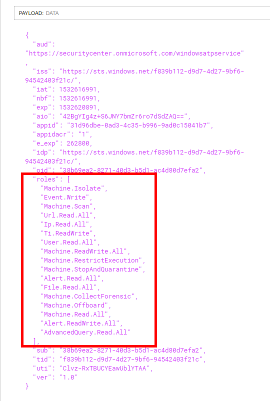

# Use Windows Defender ATP APIs 

**Applies to:**

- Windows 10 Enterprise
- Windows 10 Education
- Windows 10 Pro
- Windows 10 Pro Education
- Windows Defender Advanced Threat Protection (Windows Defender ATP)


>Want to experience Windows Defender ATP? [Sign up for a free trial.](https://www.microsoft.com/en-us/WindowsForBusiness/windows-atp?ocid=docs-wdatp-exposedapis-abovefoldlink) 

Windows Defender ATP exposes much of its data and actions through a set of programmatic APIs. Those APIs will enable you to automate workflows and innovate based on Windows Defender ATP capabilities. The API access requires OAuth2.0 authentication. For more information, see [OAuth 2.0 Authorization Code Flow](https://docs.microsoft.com/en-us/azure/active-directory/develop/active-directory-v2-protocols-oauth-code).

In general, you’ll need to take the following steps to use the APIs:
-	Create an app
-	Get an access token
-	Use Windows Defender ATP API

### Before you begin
Before using the APIs, you’ll need to create an app that you’ll use to authenticate against the graph. You’ll need to create a web app to use for the adhoc queries. 

## Create an app

1.	Log on to [Azure](https://portal.azure.com).

2.	Navigate to **Azure Active Directory** > **App registrations** > **New application registration**. 

    

3.	In the Create window, enter the following information then click **Create**.

    

    - **Name:** WdatpEcosystemPartner
    - **Application type:** Web app / API
    - **Redirect URI:** `https://WdatpEcosystemPartner.com` (The URL where user can sign in and use your app. You can change this URL later.)


4.	Click **Settings** > **Required permissions** > **Add**.

    

5.	Click **Select an API** > **WindowsDefenderATP**, then click **Select**.
	
	**Note**: WindowsDefenderATP does not appear in the original list. You need to start writing its name in the text box to see it appear.

    

6. Click **Select permissions** > **Run advanced queries** > **Select**.
	
	**Important note**: You need to select the relevant permission. 'Run advanced queries' is only an example!

    

	- In order to send telemetry events to WDATP, check 'Write timeline events' permission
	- In order to send TI events to WDATP, check 'Read and write IOCs belonging to the app' permission
	- In order to run advanced queries in WDATP, check 'Run advanced queries' permission

7. Click **Done**

    

8. Click **Keys** and type a key name and click **Save**.

	**Important**: After you save, **copy the key value**. You won't be able to retrieve after you leave!

    

9. Write down your application ID.
    
	

9. Set your application to be multi-tenanted
	
	This is **required** for 3rd party apps (i.e., if you create an application that is intended to run in multiple customers tenant).

	This is **not required** if you create a service that you want to run in your tenant only (i.e., if you create an application for your own usage that will only interact with your own data)​

	Click **Properties** > **Yes** > **Save**.

	


## Get an access token

For more details on AAD token, refer to [AAD tutorial](https://docs.microsoft.com/en-us/azure/active-directory/develop/active-directory-v2-protocols-oauth-client-creds)

### Using dedicated executable

- Download AadTokenGetter.zip application​
- Unzip the application
- Open 'AadTokenGetter.exe.config' file and fill the 3 required settings:
	- tenantId
	- appId
	- appSecret
- ​Run AadTokenGetter.exe

The token is displayed in the application window


### Using Curl 

> [!NOTE]
> The below procedure supposed Curl is already installed on your computer

- Open a command window
- ​Set CLIENT_ID to your Azure application ID
- Set CLIENT_SECRET to your Azure application secret
- Set TENANT_ID to the Azure tenant ID of the customer that wants to use your application to access WDATP application
- Run the below command:

> [!NOTE]
> The below syntax is for curl in Windows. For Linux you should use $CLIENT_ID​ instead of %CLIENT_ID% (same for CLIENT_SECRET and TENANT_ID​)

```
curl -i -X POST -H "Content-Type:application/x-www-form-urlencoded" -d "grant_type=client_credentials" -d "client_id=%CLIENT_ID%" -d "scope=https://securitycenter.onmicrosoft.com/windowsatpservice​/.default" -d "client_secret=%CLIENT_SECRET%" "https://login.microsoftonline.com/%TENANT_ID​%/oauth2/v2.0/token" -k​
```

You will get an answer of the form:

```
{"token_type":"Bearer","expires_in":3599,"ext_expires_in":0,"access_token":"eyJ0eXAiOiJKV1QiLCJhbGciOiJSUzI1NiIsIn <truncated> aWReH7P0s0tjTBX8wGWqJUdDA"}
```

## Validate the token

- Copy/paste into [JWT](https://jwt.io/) the token you get in the previous step 
- Validate you get a 'roles' claim with the desired permission, as shown in the below screenshot



## Application consent

You need your application to be approved in each tenant where you intend to use it. This is because your application interacts with WDATP application on behalf of your customer.

You (or your customer if you are writing a 3rd party application) need to click the consent link and approve your application. The consent should be done with a user who has admin privileges in the active directory.

Consent link is of the form: 

```
https://login.microsoftonline.com/common/oauth2/authorize?prompt=consent&client_id=00000000-0000-0000-0000-000000000000&response_type=code&sso_reload=true​
```

where 00000000-0000-0000-0000-000000000000​ should be replaced with your Azure application ID


## Related topics
- [Supported Windows Defender ATP APIs](supported-apis-windows-defender-advanced-threat-protection-new.md)
