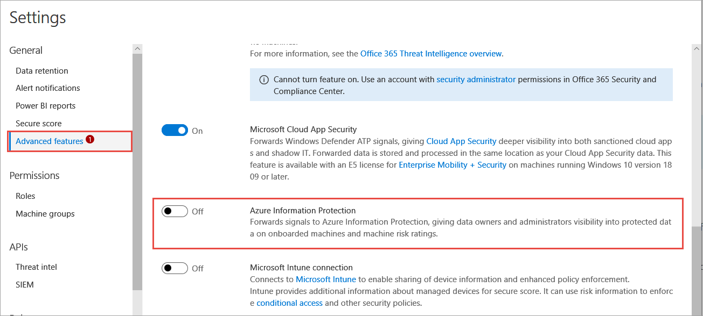

# Information protection in Windows overview
**Applies to:**
- Windows Defender Advanced Threat Protection (Windows Defender ATP)

[!include[Prerelease information](prerelease.md)]

Information protection is an integral part of Microsoft 365 Enterprise suite, providing intelligent protection to keep sensitive data secure while enabling productivity in the workplace.


Windows Defender ATP is seamlessly integrated in Microsoft information protection to provide a complete and comprehensive data loss prevention (DLP) solution for Windows devices. This solution is delivered and managed as part of the unified Microsoft 365 information protection suite. 


Windows Defender ATP applies two methods to discover and protect data:
- **Data discovery** - Identify sensitive data on Windows devices at risk
- **Data protection** - Windows Information Protection (WIP) as outcome of Microsoft Information Protection label


## Data discovery 
Windows Defender ATP automatically discovers files with Azure Information Protection (AIP) labels on Windows devices when the feature is enabled. You can enable the Azure Information Protection integration feature from Windows Defender Security Center. For more information, see [Configure advanced features](advanced-features-windows-defender-advanced-threat-protection.md#azure-information-protection).





>[!NOTE]
> You'll need the appropriate license to leverage the Windows Defender ATP and Azure Information Protection integration.

After enabling the Azure Information Protection integration, data discovery signals are immediately forwarded to Azure Information Protection from the device. When a labeled file is created or modified on a Windows device, Windows Defender ATP automatically reports the signal to AIP.

The reported signals can be viewed on the Azure Information Protection - Data discovery dashboard.

### Azure Information Protection - Data discovery dashboard 
This dashboard presents a summarized discovery information of data discovered by both Windows Defender ATP and AIP scanner. Data from Windows Defender ATP is marked with Location Type – Endpoint. 


Notice the Device Risk column on the right, this device risk is derived directly from Windows Defender ATP, indicating the risk level of the security device where the file was discovered, based on the active security threats detected by Windows Defender ATP.

Clicking the device risk level will redirect you to the device page in Windows Defender ATP, where you can get a comprehensive view of the device security status and its active alerts. 


>[!NOTE]
>Windows Defender ATP does not currently report the Information Types. 

### Log Analytics 
Data discovery based on Windows Defender ATP is also available in AIP Log Analytics, where you can perform complicated queries over the raw data. 

Open AIP Log Analytics in Azure Portal and open a query builder (standard or classic). 

To view Windows Defender ATP data, perform a query that contains: 


```
InformationProtectionLogs_CL 
| where Workload_s == "Windows Defender" 
```

**Prerequisites:**
- Tenant is enrolled to AIP. 
- Enable AIP integration in Windows Defender Security Center: 
- To benefit from the above, you need to enable AIP integration in Windows Defender ATP:
    - Go to Settings in Windows Defender ATP portal, click on Advanced Settings under General.


## Data protection 
For data to be protected, they must first be identified through labels. Sensitivity labels are created in Office Security and Compliance (SCC). Windows Defender ATP then uses the labels to identify endpoints that need Windows Information Protection (WIP) applied on them.


When you create sensitivity labels, you can set the information protection functionalities that will be applied on the file. The setting that applies to Windows Defender ATP is the Data loss prevention. You'll need to turn on the Data loss prevention and select Enable Windows end point protection (DLP for devices). 


Once, the policy is set and published, Windows Defender ATP automatically enables WIP for labeled files. When a labeled file is created or modified on a Windows device, Windows Defender ATP automatically detects it and enables WIP on that file if its label corresponds with Office Security and Compliance (SCC) policy. 

This functionality expands the coverage of WIP to protect files based on their label, regardless of their origin. 

For more information, see [Configure information protection in Windows](information-protection-in-windows-config.md).


## Related topics
- [How Windows Information Protection protects files with a sensitivity label](https://docs.microsoft.com/windows/security/information-protection/windows-information-protection/how-wip-works-with-labels)