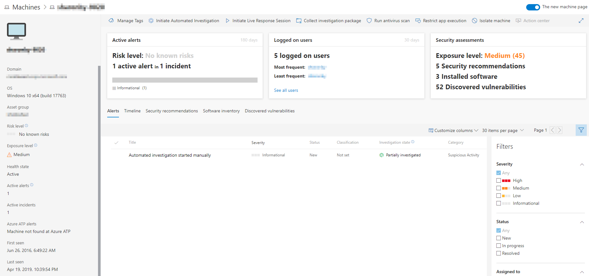
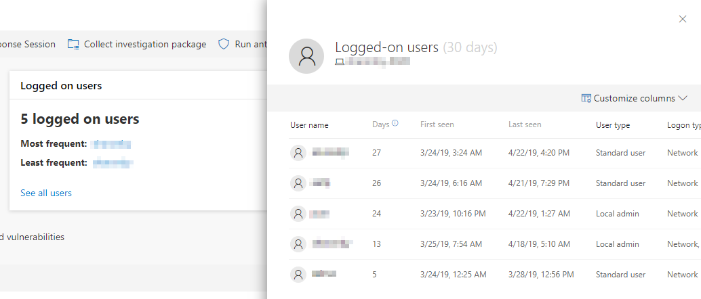
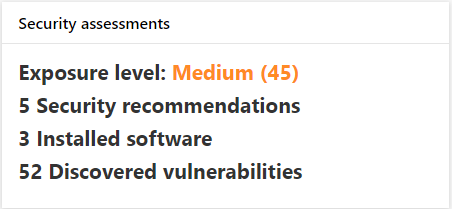
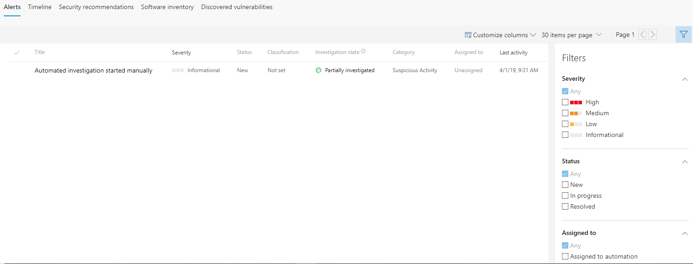
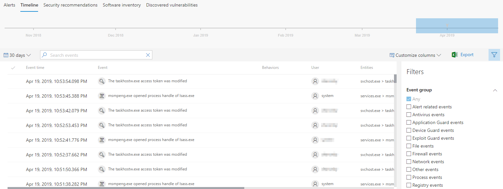

# Investigate machines in the Windows Defender ATP Machines list

**Applies to:**

- [Windows Defender Advanced Threat Protection (Windows Defender ATP)](https://go.microsoft.com/fwlink/p/?linkid=2069559)

>Want to experience Windows Defender ATP? [Sign up for a free trial.](https://www.microsoft.com/en-us/WindowsForBusiness/windows-atp?ocid=docs-wdatp-investigatemachines-abovefoldlink)

Investigate the details of an alert raised on a specific machine to identify other behaviors or events that might be related to the alert or the potential scope of breach.

You can click on affected machines whenever you see them in the portal to open a detailed report about that machine. Affected machines are identified in the following areas:

- [Machines list](investigate-machines-windows-defender-advanced-threat-protection.md)
- [Alerts queue](alerts-queue-windows-defender-advanced-threat-protection.md)
- [Security operations dashboard](security-operations-dashboard-windows-defender-advanced-threat-protection.md)
- Any individual alert
- Any individual file details view
- Any IP address or domain details view

When you investigate a specific machine, you'll see:

- Machine details
- Response actions
- Cards (active alerts, logged on users, security assessment)
- Tabs (alerts, timeline, security recommendations, software inventory, discovered vulnerabilities)

## Machine details

The machine details section provides information such as the domain, OS, and health state of the machine. If there's an investigation package available on the machine, you'll see a link that allows you to download the package.

## Response actions

Response actions run along the top of the page, and include:

- Manage tags
- Initiate Automated Investigation
- Initiate Live Response Session
- Collect investigation package
- Run antivirus scan
- Restrict app execution
- Isolate machine
- Action center (only enabled if there are investigations happening on that machine)

You can take response actions in the action center, in a specific machine page, or in a specific file page.

For more information on how to take action on a machine, see [Take response action on a machine](respond-machine-alerts-windows-defender-advanced-threat-protection.md).

## Cards

### Active alerts

If you have enabled the Azure ATP feature and there are alerts related to the machine, you can view a high level overview of the alerts and risk level. More information is available in the "Alerts" drill down.

>[!NOTE]
>You'll need to enable the integration on both Azure ATP and Windows Defender ATP to use this feature. In Windows Defender ATP, you can enable this feature in advanced features. For more information on how to enable advanced features, see [Turn on advanced features](advanced-features-windows-defender-advanced-threat-protection.md).

### Logged on users

The "Logged on users" tile shows the amount of users who have logged on in the past 30 days, along with the most and least frequent users. Selecting the"See all users" hyperlink opens the details pane that displays information such as user and logon type, and first/last seen. For more information, see [Investigate user entities](investigate-user-windows-defender-advanced-threat-protection.md).

### Security assessments

The Security assessments tile shows the overall exposure level, security recommendations, installed software, and discovered vulnerabilities. A machine's exposure level is determined by the cumulative impact of it's pending security recommendations.

## Tabs

The five tabs under the cards section show relevant security and threat prevention information related to the machine.

### Alerts

The **Alerts** section provides a list of alerts that are associated with the machine. This list is a filtered version of the [Alerts queue](alerts-queue-windows-defender-advanced-threat-protection.md), and shows a short description of the alert, severity (high, medium, low, informational), status in the queue (new, in progress, resolved), classification (not set, false alert, true alert), investigation state, category of alert, who is addressing the alert, and last activity.

When the circle icon to the left of an alert is selected, a fly-out appears. From this panel you can manage the alert and view more details such as incident number and related machines. Multiple alerts can be selected at a time.

To see a full page view of an alert including incident graph and process tree, select the title of the alert.

### Timeline

The **Timeline** section provides a chronological view of the events and associated alerts that have been observed on the machine. This can help you correlate any events, files, and IP addresses in relation to the machine.

Timeline also enables you to selectively drill down into events that occurred within a given time period. You can view the temporal sequence of events that occurred on a machine over a selected time period.

To further control your view, you can filter by event groups or customize the columns.

>[!NOTE]
> For firewall events to be displayed, you'll need to enable the audit policy, see [Audit Filtering Platform connection](https://docs.microsoft.com/windows/security/threat-protection/auditing/audit-filtering-platform-connection).
>Firewall covers the following events
>- [5025](https://docs.microsoft.com/windows/security/threat-protection/auditing/event-5025) - firewall service stopped
>- [5031](https://docs.microsoft.com/windows/security/threat-protection/auditing/event-5031) - application blocked from accepting incoming connections on the network
>- [5157](https://docs.microsoft.com/windows/security/threat-protection/auditing/event-5157) - blocked connection

Some of the functionality includes:

- Search for specific events
  - Use the search bar to look for specific timeline events.
- Filter events from a specific date
  - Select the calendar icon in the upper left of the table to display events in the past day, week, 30 days, or custom range. By default, the machine timeline is set to display the events from the past 30 days.
  - Use the timeline to jump to a specific moment in time by highlighting the section. The arrows on the timelime pinpoint automated investigations
- Export detailed machine timeline events
  - You can choose to export the machine timeline for the current date or a specified date range up to seven days.

You can also use the [Artifact timeline](investigate-alerts-windows-defender-advanced-threat-protection.md#artifact-timeline) feature to see the correlation between alerts and events on a specific machine.

### Security recommendations

**Security recommendations** are generated from Microsoft Defender ATP's [Threat & Vulnerability Management](https://docs.microsoft.com/windows/security/threat-protection/windows-defender-atp/tvm-dashboard-insights) capability. Selecting a recommendation will show a panel where you can view relevant details such as description of the recommendation and the potential risks associated with not enacting it.

### Software inventory

The **Software inventory** section lets you view software on the device, along with any weaknesses or threats. Selecting the name of the software will take you to the software details page where you can view security recommendations, discovered vulnerabilities, installed machines, and version distribution.

### Discovered vulnerabilities

The **Discovered vulnerabilities** section shows the name, severity, and threat insights of discovered vulnerabilities on the device. Selecting specific vulnerabilities will show a description and details.

## Related topics

- [View and organize the Windows Defender Advanced Threat Protection Alerts queue](alerts-queue-windows-defender-advanced-threat-protection.md)
- [Manage Windows Defender Advanced Threat Protection alerts](manage-alerts-windows-defender-advanced-threat-protection.md)
- [Investigate Windows Defender Advanced Threat Protection alerts](investigate-alerts-windows-defender-advanced-threat-protection.md)
- [Investigate a file associated with a Windows Defender ATP alert](investigate-files-windows-defender-advanced-threat-protection.md)
- [Investigate an IP address associated with a Windows Defender ATP alert](investigate-ip-windows-defender-advanced-threat-protection.md)
- [Investigate a domain associated with a Windows Defender ATP alert](investigate-domain-windows-defender-advanced-threat-protection.md)
- [Investigate a user account in Windows Defender ATP](investigate-user-windows-defender-advanced-threat-protection.md)
