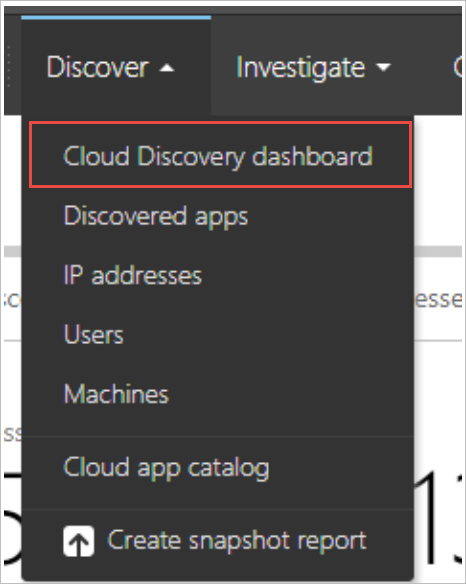
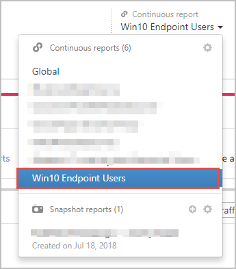

# Configure Microsoft Cloud App Security in Windows
**Applies to:**
- [Windows Defender Advanced Threat Protection (Windows Defender ATP)](https://wincom.blob.core.windows.net/documents/Windows10_Commercial_Comparison.pdf)

[!include[Prerelease�information](prerelease.md)]

To benefit from Windows Defender Advanced Threat Protection (ATP) cloud app discovery signals, turn on Microsoft Cloud App Security integration.

>[!NOTE]
>This feature is available with an E5 license for [Enterprise Mobility + Security](https://www.microsoft.com/cloud-platform/enterprise-mobility-security) on machines running Windows 10 version 1809 or later.

1. In the navigation pane, select **Preferences setup** > **Advanced features**.
2. Select **Microsoft Cloud App Security** and switch the toggle to **On**.
3. Click **Save preferences**.
 

Once activated, Windows Defender ATP will immediately start forwarding discovery signals to Cloud App Security.

## View the data collected

1. Browse to the [Cloud App Security portal](https://portal.cloudappsecurity.com).

2. Navigate to the Cloud Discovery dashboard.

    

3. Select **Win10 Endpoint Users report**, which contains the data coming from Windows Defender ATP.

    

This report is similar to the existing discovery report with one major difference: you can now benefit from visibility to the machine context.

Notice the new **Machines** tab that allows you to view the data split to the device dimensions. This is available in the main report page or any subpage (for example, when drilling down to a specific cloud app).

For more information about cloud discovery, see [Working with discovered apps](https://docs.microsoft.com/cloud-app-security/discovered-apps).

If you are interested in trying Microsoft Cloud App Security, see [Microsoft Cloud App Security Trial](https://signup.microsoft.com/Signup?OfferId=757c4c34-d589-46e4-9579-120bba5c92ed&ali=1).

## Related topic
- [Microsoft Cloud App Security integration](microsoft-cloud-app-security-integration.md)