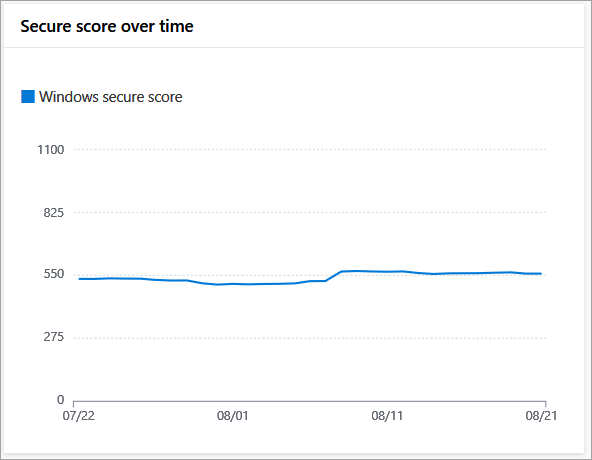
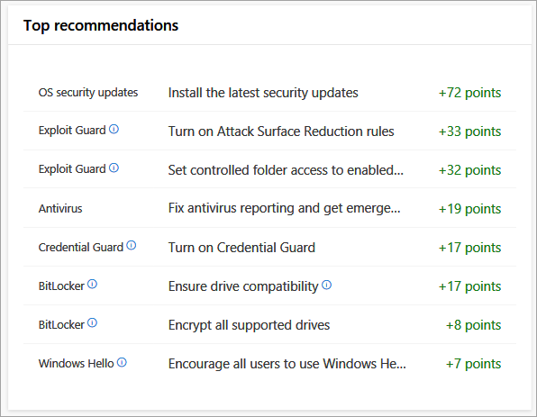
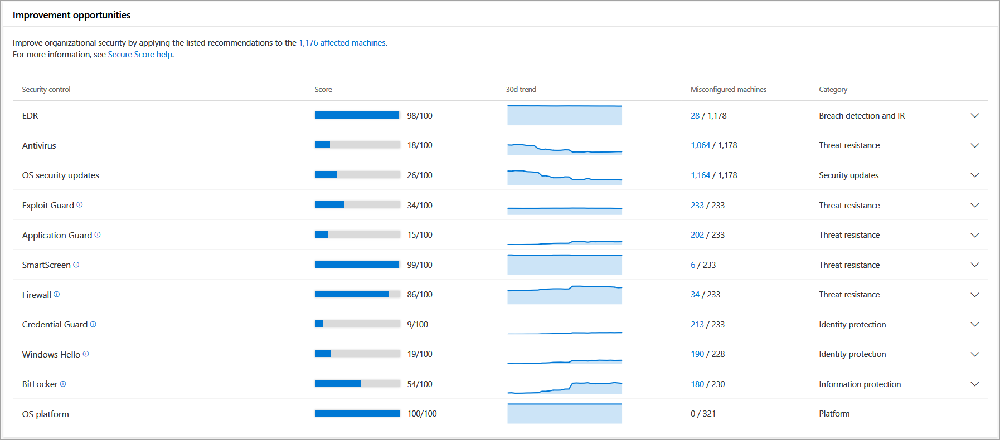

# Overview of Secure score in Windows Defender Security Center
**Applies to:**
- [Windows Defender Advanced Threat Protection (Windows Defender ATP)](https://go.microsoft.com/fwlink/p/?linkid=2069559)

The Secure score dashboard expands your visibility into the overall security posture of your organization. From this dashboard, you'll be able to quickly assess the security posture of your organization, see machines that require attention, as well as recommendations for actions to further reduce the attack surface in your organization - all in one place. From there you can take action based on the recommended configuration baselines.

>[!IMPORTANT]
> This feature is available for machines on Windows 10, version  1703 or later. 

The **Secure score dashboard** displays a snapshot of:
- Microsoft secure score
- Secure score over time
- Top recommendations
- Improvement opportunities

## Microsoft secure score
The Microsoft secure score tile is reflective of the sum of all the Windows Defender security controls that are configured according to the recommended baseline and Office 365 controls. It allows you to drill down into each portal for further analysis. You can also improve this score by taking the steps in configuring each of the security controls in the optimal settings.

Each Windows Defender security control contributes 100 points to the score. The total number is reflective of the score potential and calculated by multiplying the number of supported security controls (Windows Defender security controls pillars) by the maximum points that each pillar contributes (maximum of 100 points for each pillar). 

The Office 365 Secure Score looks at your settings and activities and compares them to a baseline established by Microsoft. For more information, see [Introducing the Office 365 Secure Score](https://support.office.com/en-us/article/introducing-the-office-365-secure-score-c9e7160f-2c34-4bd0-a548-5ddcc862eaef#howtoaccess).

In the example image, the total points for the Windows security controls and Office 365 add up to 602 points. 

You can set the baselines for calculating the score of Windows Defender security controls on the Secure score dashboard through the **Settings**. For more information, see [Enable Secure score security controls](enable-secure-score-windows-defender-advanced-threat-protection.md).

## Secure score over time
You can track the progression of your organizational security posture over time using this tile. It displays the overall score in a historical trend line enabling you to see how taking the recommended actions increase your overall security posture.

You can mouse over specific date points to see the total score for that security control is on a specific date.

## Top recommendations
Reflects specific actions you can take to significantly increase the security stance of your organization and how many points will be added to the secure score if you take the recommended action.

## Improvement opportunities 
Improve your score by taking the recommended improvement actions listed on this tile. The goal is to reduce the gap between the perfect score and the current score for each control.

Clicking on the affected machines link at the top of the table takes you to the Machines list. The list is filtered to reflect the list of machines where improvements can be made. 

Within the tile, you can click on each control to see the recommended optimizations.

Clicking the link under the Misconfigured machines column opens up the **Machines list** with filters applied to show only the list of machines where the recommendation is applicable. You can export the list in Excel to create a target collection and apply relevant policies using a management solution of your choice.

## Related topic
- [Threat analytics](threat-analytics-dashboard-windows-defender-advanced-threat-protection.md)
- [Threat analytics for Spectre and Meltdown](threat-analytics-dashboard-windows-defender-advanced-threat-protection.md)
