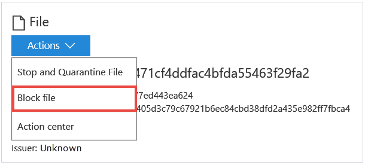
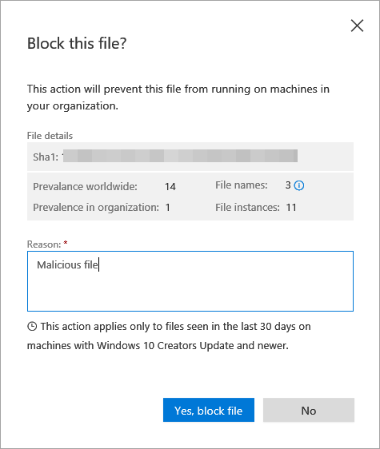
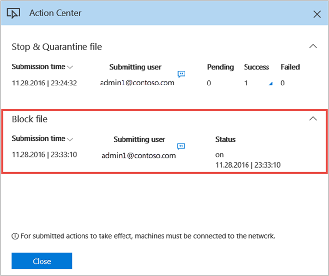
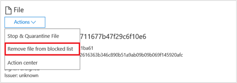
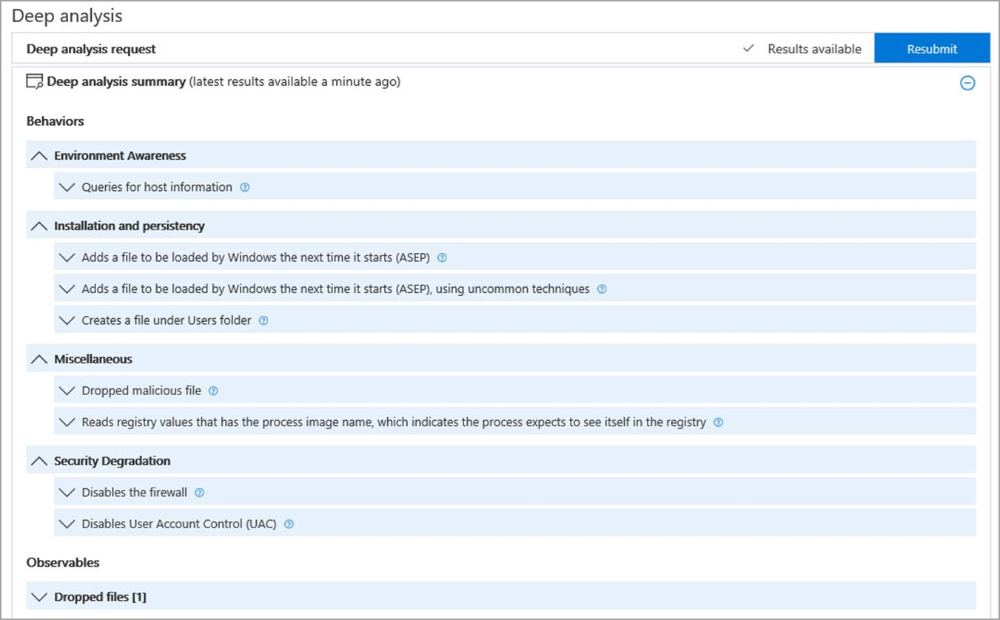

# Take response actions on a file

**Applies to:**
- [Windows Defender Advanced Threat Protection (Windows Defender ATP)](https://go.microsoft.com/fwlink/p/?linkid=2069559)


>Want to experience Windows Defender ATP? [Sign up for a free trial.](https://www.microsoft.com/en-us/WindowsForBusiness/windows-atp?ocid=docs-wdatp-responddile-abovefoldlink) 

Quickly respond to detected attacks by stopping and quarantining files or blocking a file. After taking action on files, you can check activity details on the Action center.

>[!IMPORTANT]
>These response actions are only available for machines on Windows 10, version 1703 or later.

You can also submit files for deep analysis to run the file in a secure cloud sandbox. When the analysis is complete, you'll get a detailed report that provides information about the behavior of the file.

## Stop and quarantine files in your network
You can contain an attack in your organization by stopping the malicious process and quarantine the file where it was observed.

>[!IMPORTANT]
>You can only take this action if:
> - The machine you're taking the action on is running Windows 10, version 1703 or later
> - The file does not belong to trusted third-party publishers or not signed by Microsoft
> - Windows Defender Antivirus must at least be running on Passive mode. For more information, see [Windows Defender Antivirus compatibility](../windows-defender-antivirus/windows-defender-antivirus-compatibility.md).

The **Stop and Quarantine File** action includes stopping running processes, quarantining the files, and deleting persistency such as registry keys.

The action takes effect on machines with Windows 10, version 1703 or later, where the file was observed in the last 30 days.

>[!NOTE]
>You’ll be able to restore the file from quarantine at any time.

### Stop and quarantine files
1.	Select the file you want to stop and quarantine. You can select a file from any of the following views or use the Search box:

  - **Alerts** - click the corresponding links from the Description or Details in the Artifact timeline
  - **Search box** - select File from the drop–down menu and enter the file name

2.	Open the **Actions menu** and select **Stop and Quarantine File**.

    

3. Specify a reason, then click **Yes, stop and quarantine**.

    

    The Action center shows the submission information:
    

    - **Submission time** - Shows when the action was submitted.
    - **Success** - Shows the number of machines where the file has been stopped and quarantined.
    - **Failed** - Shows the number of machines where the action failed and details about the failure.
    - **Pending** - Shows the number of machines where the file is yet to be stopped and quarantined from. This can take time for cases when the machine is offline or not connected to the network.

4. Select any of the status indicators to view more information about the action. For example, select **Failed** to see where the action failed.

**Notification on machine user**:</br>
When the file is being removed from a machine, the following notification is shown:


In the machine timeline, a new event is added for each machine where a file was stopped and quarantined.

>[!IMPORTANT]
>The **Action** button is turned off for files signed by Microsoft as well as trusted third–party publishers to prevent the removal of critical system files and files used by important applications.


For prevalent files in the organization, a warning is shown before an action is implemented to validate that the operation is intended.

## Remove file from quarantine
You can roll back and remove a file from quarantine if you’ve determined that it’s clean after an investigation. Run the following command on each machine where the file was quarantined.

1.	Open an elevated command–line prompt on the machine:

    a.	Go to **Start** and type cmd.

    b.	Right–click **Command prompt** and select **Run as administrator**.

2.	Enter the following command, and press **Enter**:
  ```
  “%ProgramFiles%\Windows Defender\MpCmdRun.exe” –Restore –Name EUS:Win32/CustomEnterpriseBlock –All
  ```

> [!NOTE]
> Windows Defender ATP will restore all files that were quarantined on this machine in the last 30 days.

## Block files in your network
You can prevent further propagation of an attack in your organization by banning potentially malicious files or suspected malware. If you know a potentially malicious portable executable (PE) file, you can block it. This operation will prevent it from being read, written, or executed on machines in your organization.

>[!IMPORTANT]
>- This feature is available if your organization uses Windows Defender Antivirus and Cloud–based protection is enabled. For more information, see [Manage cloud–based protection](../windows-defender-antivirus/deploy-manage-report-windows-defender-antivirus.md).
>- The Antimalware client version must be 4.18.1901.x or later.
>- This feature is designed to prevent suspected malware (or potentially malicious files) from being downloaded from the web. It currently supports portable executable (PE) files, including _.exe_ and _.dll_ files. The coverage will be extended over time. 
>- This response action is available for machines on Windows 10, version 1703 or later.
>- The allow or block function cannot be done on files if the file's classification exists on the device's cache prior to the allow or block action.


>[!NOTE]
> The PE file needs to be in the machine timeline for you to be able to take this action.  
>- There may be a couple of minutes of latency between the time the action is taken and the actual file being blocked.

### Enable the block file feature
Before you can block files, you'll need to enable the feature.

1.	In the navigation pane, select **Settings** > **Advanced features** > **Block file**.

2.	Toggle the setting between **On** and **Off** and select **Save preferences**.
    
    
  
### Block a file
1.	Select the file you want to block. You can select a file from any of the following views or use the Search box:

  - **Alerts** - click the corresponding links from the Description or Details in the Artifact timeline
  - **Search box** - select File from the drop–down menu and enter the file name

2.	Open the **Actions menu** and select **Block**. 
    
    

3. Specify a reason and select **Yes, block file** to take action on the file.
    
    

    The Action center shows the submission information:
    

  - **Submission time** - Shows when the action was submitted. <br>
  - **Submitting user** - Shows who submitted the action on the file. You can view the comments provided by the user by selecting the information icon. <br>
  - **Status** - Indicates whether the file was added to or removed from the blacklist.

When the file is blocked, there will be a new event in the machine timeline.</br>

>[!NOTE]
>-If a file was scanned before the action was taken, it may take longer to be effective on the device.

**Notification on machine user**:</br>
When a file is being blocked on the machine, the following notification is displayed to inform the user that the file was blocked:


>[!NOTE]
>The **Action** button is turned off for files signed by Microsoft to prevent negative impact on machines in your organization caused by the removal of files that might be related to the operating system.


For prevalent files in the organization, a warning is shown before an action is implemented to validate that the operation is intended.

## Remove file from blocked list
1.	Select the file you want to remove from the blocked list. You can select a file from any of the following views or use the Search box:

  - **Alerts** - Click the file links from the Description or Details in the Artifact timeline <br>
  - **Search box** - Select File from the drop–down menu and enter the file name

2.	Open the **Actions** menu and select **Remove file from blocked list**.

  

3. Type a comment and select **Yes** to take action on the file. The file will be allowed to run in the organization.


## Check activity details in Action center
The  **Action center** provides information on actions that were taken on a machine or file. You’ll be able to view the details on the last action that were taken on a file such as stopped and quarantined files or blocked files.


## Deep analysis
Cyber security investigations are typically triggered by an alert. Alerts are related to one or more observed files that are often new or unknown. Clicking a file takes you to the file view where you can see the file's metadata. To enrich the data related to the file, you can submit the file for deep analysis.

The deep analysis feature executes a file in a secure, fully instrumented cloud environment. Deep analysis results show the file's activities, observed behaviors, and associated artifacts, such as dropped files, registry modifications, and communication with IPs.
Deep analysis currently supports extensive analysis of portable executable (PE) files (including _.exe_ and _.dll_ files).

Deep analysis of a file takes several minutes. When the file analysis is complete, results are made available in the File view page, under a new **Deep analysis summary** section. The summary includes a list of observed *behaviors*, some of which can indicate malicious activity, and *observables*, including contacted IPs and files created on the disk.

Results of deep analysis are matched against threat intelligence and any matches will generate appropriate alerts.

### Submit files for analysis

Use the deep analysis feature to investigate the details of any file, usually during an investigation of an alert or for any other reason where you suspect malicious behavior. This feature is available in the context of the file view.

In the file's page, **Submit for deep analysis** is enabled when the file is available in the Windows Defender ATP backend sample collection or if it was observed on a Windows 10 machine that supports submitting to deep analysis.

> [!NOTE]
> Only files from Windows 10 can be automatically collected.

You can also manually submit a sample through the [Malware Protection Center Portal](https://www.microsoft.com/security/portal/submission/submit.aspx) if the file was not observed on a Windows 10 machine, and wait for **Submit for deep analysis** button to become available.

> [!NOTE]
> Due to backend processing flows in the Malware Protection Center Portal, there could be up to 10 minutes of latency between file submission and availability of the deep analysis feature in Windows Defender ATP.

When the sample is collected, Windows Defender ATP runs the file in is a secure environment and creates a detailed report of observed behaviors and associated artifacts, such as files dropped on machines, communication to IPs, and registry modifications.

**Submit files for deep analysis:**

1. Select the file that you want to submit for deep analysis. You can select or search a file from any of the following views: <br>
  - Alerts - click the file links from the **Description** or **Details** in the Artifact timeline <br>
  - **Machines list** - click the file links from the **Description** or **Details** in the **Machine in organization** section <br>
  - Search box - select **File** from the drop–down menu and enter the file name <br>
2. In the **Deep analysis** section of the file view, click **Submit**.

    

>**Note**&nbsp;&nbsp;Only PE files are supported, including _.exe_ and _.dll_ files

A progress bar is displayed and provides information on the different stages of the analysis. You can then view the report when the analysis is done.

> [!NOTE]
> Depending on machine availability, sample collection time can vary. There is a 3–hour timeout for sample collection. The collection will fail and the operation will abort if there is no online Windows 10 machine reporting at that time. You can re–submit files for deep analysis to get fresh data on the file.

### View deep analysis reports

View the deep analysis report that Windows Defender ATP provides to see the details of the deep analysis that was conducted on the file you submitted. This feature is available in the file view context.

You can view the comprehensive report that provides details on the following sections:

- Behaviors
- Observables

The details provided can help you investigate if there are indications of a potential attack.


1. Select the file you submitted for deep analysis.
2. Click **See the report below**. Information on the analysis is displayed.

    

### Troubleshoot deep analysis

If you encounter a problem when trying to submit a file, try each of the following troubleshooting steps.


1. Ensure that the file in question is a PE file. PE files typically have _.exe_ or _.dll_ extensions (executable programs or applications).
2. Ensure the service has access to the file, that it still exists, and has not been corrupted or modified.
3. You can wait a short while and try to submit the file again, in case the queue is full or there was a temporary connection or communication error.
4. Verify the policy setting enables sample collection and try to submit the file again.

  a. Change the following registry entry and values to change the policy on specific machines:
 ```
Path: HKLM\SOFTWARE\Policies\Microsoft\Windows Advanced Threat Protection
Name: AllowSampleCollection 
Type: DWORD 
Hexadecimal value : 
  Value = 0 – block sample collection
  Value = 1 – allow sample collection
```
5. Change the organizational unit through the Group Policy. For more information, see [Configure with Group Policy](configure-endpoints-gp-windows-defender-advanced-threat-protection.md).
6. If these steps do not resolve the issue, contact [winatp@microsoft.com](mailto:winatp@microsoft.com).

> [!NOTE]
> If the value *AllowSampleCollection* is not available, the client will allow sample collection by default.

## Related topic
- [Take response actions on a machine](respond-machine-alerts-windows-defender-advanced-threat-protection.md)
