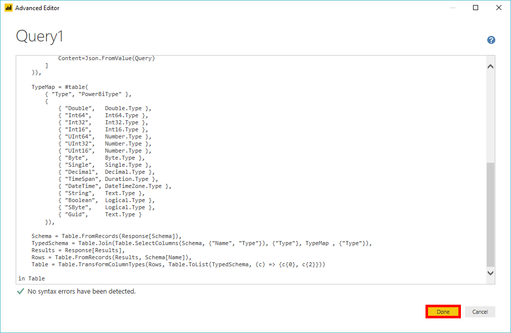

---
title: Advanced Hunting API
description: Use this API to run advanced queries
keywords: apis, supported apis, advanced hunting, query
search.product: eADQiWindows 10XVcnh
ms.prod: w10
ms.mktglfcycl: deploy
ms.sitesec: library
ms.pagetype: security
ms.author: macapara
author: mjcaparas
ms.localizationpriority: medium
manager: dansimp
audience: ITPro
ms.collection: M365-security-compliance 
ms.topic: article
---

# Create custom reports using Power BI (user authentication)
**Applies to:**
- Windows Defender Advanced Threat Protection (Windows Defender ATP)

[!include[Prerelease information](prerelease.md)]


Run advanced queries and show results in Microsoft Power BI. Please read about [Advanced Hunting API](run-advanced-query-api.md) before.

In this section we share Power BI query sample to run a query using **user token**.

If you want to use **application token** instead please refer to [this](run-advanced-query-sample-power-bi-app-token.md) tutorial.

## Before you begin
You first need to [create an app](exposed-apis-create-app-nativeapp.md).

## Run a query

- Open Microsoft Power BI

- Click **Get Data** > **Blank Query**

    

- Click **Advanced Editor**

    

- Copy the below and paste it in the editor, after you update the values of Query

	```
	let 

		Query = "MachineInfo | where EventTime > ago(7d) | summarize EventCount=count(), LastSeen=max(EventTime) by MachineId",

		FormattedQuery= Uri.EscapeDataString(Query),

		AdvancedHuntingUrl = "https://api.securitycenter.windows.com/api/advancedqueries?key=" & FormattedQuery,

		Response = Json.Document(Web.Contents(AdvancedHuntingUrl)),

		TypeMap = #table(
			{ "Type", "PowerBiType" },
			{
				{ "Double",   Double.Type },
				{ "Int64",    Int64.Type },
				{ "Int32",    Int32.Type },
				{ "Int16",    Int16.Type },
				{ "UInt64",   Number.Type },
				{ "UInt32",   Number.Type },
				{ "UInt16",   Number.Type },
				{ "Byte",     Byte.Type },
				{ "Single",   Single.Type },
				{ "Decimal",  Decimal.Type },
				{ "TimeSpan", Duration.Type },
				{ "DateTime", DateTimeZone.Type },
				{ "String",   Text.Type },
				{ "Boolean",  Logical.Type },
				{ "SByte",    Logical.Type },
				{ "Guid",     Text.Type }
			}),

		Schema = Table.FromRecords(Response[Schema]),
		TypedSchema = Table.Join(Table.SelectColumns(Schema, {"Name", "Type"}), {"Type"}, TypeMap , {"Type"}),
		Results = Response[Results],
		Rows = Table.FromRecords(Results, Schema[Name]),
		Table = Table.TransformColumnTypes(Rows, Table.ToList(TypedSchema, (c) => {c{0}, c{2}}))

	in Table

	```

- Click **Done**

    

- Click **Edit Credentials**

    

- Select **Organizational account** > **Sign in**

    

- Enter your credentials and wait to be signed in

- Click **Connect**

    

- View the results of your query

    

## Related topic
- [Create custom Power BI reports with app authentication](run-advanced-query-sample-power-bi-app-token.md)
- [Windows Defender ATP APIs](apis-intro.md)
- [Advanced Hunting API](run-advanced-query-api.md)
- [Advanced Hunting using PowerShell](run-advanced-query-sample-powershell.md)
- [Schedule Advanced Hunting](run-advanced-query-sample-ms-flow.md)
