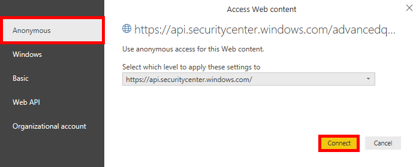
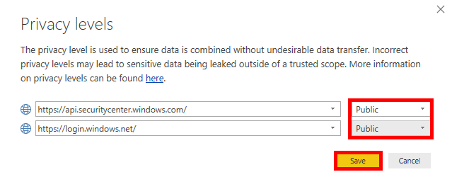

---
title: Advanced Hunting API
description: Use this API to run advanced queries
keywords: apis, supported apis, advanced hunting, query
search.product: eADQiWindows 10XVcnh
ms.prod: w10
ms.mktglfcycl: deploy
ms.sitesec: library
ms.pagetype: security
ms.author: macapara
author: mjcaparas
ms.localizationpriority: medium
ms.date: 30/07/2018
---

# Create custom reports using Power BI

Run advanced queries and show results in Microsoft Power BI. Please read about [Advanced Hunting API](run-advanced-query-api.md) before.

In this section we share Power BI query sample to run a query using application token.

>**Prerequisite**: You first need to [create an app](exposed-apis-intro.md).

## Run a query

- Open Microsoft Power BI

- Click **Get Data** > **Blank Query**

    

- Click **Advanced Editor**

    

- Copy the below and paste it in the editor, after you update the values of _TenantId, _AppId, _AppSecret, _Query

```
let 

    TenantId = "00000000-0000-0000-0000-000000000000", // Paste your own tenant ID here
    AppId = "11111111-1111-1111-1111-111111111111", // Paste your own app ID here
    AppSecret = "22222222-2222-2222-2222-222222222222", // Paste your own app secret here
    Query = "MachineInfo | where EventTime > ago(7d) | summarize EventCount=count(), LastSeen=max(EventTime) by MachineId", // Paste your own query here
    
    ResourceAppIdUrl = "https://securitycenter.onmicrosoft.com/windowsatpservice",
    OAuthUrl = Text.Combine({"https://login.windows.net/", TenantId, "/oauth2/token"}, ""),

    Resource = Text.Combine({"resource", Uri.EscapeDataString(ResourceAppIdUrl)}, "="),
    ClientId = Text.Combine({"client_id", AppId}, "="),
    ClientSecret = Text.Combine({"client_secret", Uri.EscapeDataString(AppSecret)}, "="),
    GrantType = Text.Combine({"grant_type", "client_credentials"}, "="),
	
    Body = Text.Combine({Resource, ClientId, ClientSecret, GrantType}, "&"),

    AuthResponse= Json.Document(Web.Contents(OAuthUrl, [Content=Text.ToBinary(Body)])),
    AccessToken= AuthResponse[access_token],
    Bearer = Text.Combine({"Bearer", AccessToken}, " "),
    
    AdvancedHuntingUrl = "https://api.securitycenter.windows.com/advancedqueries/query",
    
    Response = Json.Document(Web.Contents(
        AdvancedHuntingUrl, 
        [
            Headers = [#"Content-Type"="application/json", #"Accept"="application/json", #"Authorization"=Bearer],
            Content=Json.FromValue(Query)
        ]
    )),

    TypeMap = #table(
        { "Type", "PowerBiType" },
        {
            { "Double",   Double.Type },
            { "Int64",    Int64.Type },
            { "Int32",    Int32.Type },
            { "Int16",    Int16.Type },
            { "UInt64",   Number.Type },
            { "UInt32",   Number.Type },
            { "UInt16",   Number.Type },
            { "Byte",     Byte.Type },
            { "Single",   Single.Type },
            { "Decimal",  Decimal.Type },
            { "TimeSpan", Duration.Type },
            { "DateTime", DateTimeZone.Type },
            { "String",   Text.Type },
            { "Boolean",  Logical.Type },
            { "SByte",    Logical.Type },
            { "Guid",     Text.Type }
        }),

    Schema = Table.FromRecords(Response[Schema]),
    TypedSchema = Table.Join(Table.SelectColumns(Schema, {"Name", "Type"}), {"Type"}, TypeMap , {"Type"}),
    Results = Response[Results],
    Rows = Table.FromRecords(Results, Schema[Name]),
    Table = Table.TransformColumnTypes(Rows, Table.ToList(TypedSchema, (c) => {c{0}, c{2}}))
        
in Table

```

- Click **Done**

    

- Click **Edit Credentials**

    

- Select **Anonymous** and click **Connect**

    

- Repeat the previous step for the second URL

- Click **Continue**

    

- Select the privacy level you want and click **Save**

    


## Related topic
- [Windows Defender ATP APIs](exposed-apis-intro.md)
- [Advanced Hunting API](run-advanced-query-api.md)
- [Advanced Hunting using PowerShell](run-advanced-query-sample-powershell.md)
- [Schedule Advanced Hunting](run-advanced-query-sample-ms-flow.md)
