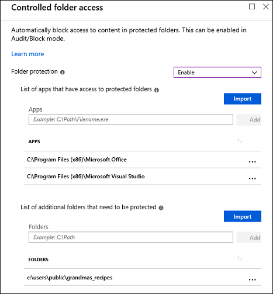

# Enable controlled folder access

**Applies to:**

- [Windows Defender Advanced Threat Protection (Windows Defender ATP)](https://go.microsoft.com/fwlink/p/?linkid=2069559)

[Controlled folder access](controlled-folders-exploit-guard.md) helps you protect valuable data from malicious apps and threats, such as ransomware. It is part of [Windows Defender Exploit Guard](windows-defender-exploit-guard.md). Controlled folder access is included with Windows 10 and Windows Server 2019.

You can enable controlled folder access by using any of the these methods:

- [Windows Security app](#windows-security-app)
- [Microsoft Intune](#intune) 
- [Mobile Device Management (MDM)](#mdm)
- [System Center Configuration Manager (SCCM)](#sccm)
- [Group Policy](#group-policy)
- [PowerShell](#powershell)

[Audit mode](evaluate-controlled-folder-access.md) allows you to test how the feature would work (and review events) without impacting the normal use of the machine.

Group Policy settings that disable local administrator list merging will override controlled folder access settings. They also override protected folders and allowed apps set by the local administrator through controlled folder access. These policies include:
- Windows Defender Antivirus **Configure local administrator merge behavior for lists**
- System Center Endpoint Protection **Allow users to add exclusions and overrides**

For more information about disabling local list merging, see [Prevent or allow users to locally modify Windows Defender AV policy settings](https://docs.microsoft.com/windows/security/threat-protection/windows-defender-antivirus/configure-local-policy-overrides-windows-defender-antivirus#configure-how-locally-and-globally-defined-threat-remediation-and-exclusions-lists-are-merged).

## Windows Security app

1. Open the Windows Security app by clicking the shield icon in the task bar or searching the start menu for **Defender**.

2. Click the **Virus & threat protection** tile (or the shield icon on the left menu bar) and then click **Ransomware protection**.

3. Set the switch for **Controlled folder access** to **On**.

>[!NOTE]
>If controlled folder access is configured with Group Policy, PowerShell, or MDM CSPs, the state will change in the Windows Security app after a restart of the device.
>If the feature is set to **Audit mode** with any of those tools, the Windows Security app will show the state as **Off**.

## Intune

1. Sign in to the [Azure portal](https://portal.azure.com) and open Intune.
1. Click **Device configuration** > **Profiles** > **Create profile**.
1. Name the profile, choose **Windows 10 and later** and **Endpoint protection**.
    
1. Click **Configure** > **Windows Defender Exploit Guard** > **Network filtering** > **Enable**. 
1. Type the path to each application that has access to protected folders and the path to any additional folder that needs protection and click **Add**. 
   
   >[!NOTE]
   >Wilcard is supported for applications, but not for folders. Subfolders are not protected. Allowed apps will continue to trigger events until they are restarted. 
1. Click **OK** to save each open blade and click **Create**. 
1. Click the profile **Assignments**, assign to **All Users & All Devices**, and click **Save**.

## MDM 

Use the [./Vendor/MSFT/Policy/Config/ControlledFolderAccessProtectedFolders](https://docs.microsoft.com/en-us/windows/client-management/mdm/policy-csp-defender#defender-controlledfolderaccessprotectedfolders) configuration service provider (CSP) to allow apps to make changes to protected folders. 

## SCCM

1. In System Center Configuration Manager, click **Assets and Compliance** > **Endpoint Protection** > **Windows Defender Exploit Guard**.
1. Click **Home** > **Create Exploit Guard Policy**.
1. Enter a name and a description, click **Controlled folder access**, and click **Next**.
1. Choose whether block or audit changes, allow other apps, or add other folders, and click **Next**.
   >[!NOTE]
   >Wilcard is supported for applications, but not for folders. Subfolders are not protected. Allowed apps will continue to trigger events until they are restarted.
1. Review the settings and click **Next** to create the policy.
1. After the policy is created, click **Close**. 

## Group Policy

1.  On your Group Policy management machine, open the [Group Policy Management Console](https://technet.microsoft.com/library/cc731212.aspx), right-click the Group Policy Object you want to configure and click **Edit**.

3.  In the **Group Policy Management Editor** go to **Computer configuration** and click **Administrative templates**.

5.  Expand the tree to **Windows components > Windows Defender Antivirus > Windows Defender Exploit Guard > Controlled folder access**.

6. Double-click the **Configure Controlled folder access** setting and set the option to **Enabled**. In the options section you must specify one of the following:
    - **Enable** - Malicious and suspicious apps will not be allowed to make changes to files in protected folders. A notification will be provided in the Windows event log
    - **Disable (Default)** - The Controlled folder access feature will not work. All apps can make changes to files in protected folders.
    - **Audit Mode** - If a malicious or suspicious app attempts to make a change to a file in a protected folder, the change will be allowed but will be recorded in the Windows event log. This allows you to assess the impact of this feature on your organization.

    

>[!IMPORTANT]
>To fully enable controlled folder access, you must set the Group Policy option to **Enabled** and also select **Enable** in the options drop-down menu.

## PowerShell

1. Type **powershell** in the Start menu, right click **Windows PowerShell** and click **Run as administrator**.

2. Enter the following cmdlet:

    ```PowerShell
    Set-MpPreference -EnableControlledFolderAccess Enabled
    ```

You can enable the feature in audit mode by specifying `AuditMode` instead of `Enabled`.

Use `Disabled` to turn the feature off.

## Related topics

- [Protect important folders with controlled folder access](controlled-folders-exploit-guard.md)
- [Customize controlled folder access](customize-controlled-folders-exploit-guard.md) 
- [Evaluate Windows Defender ATP](evaluate-windows-defender-exploit-guard.md)
