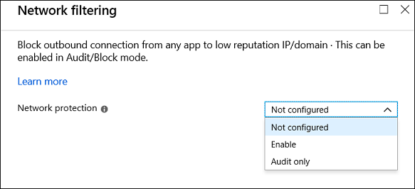

# Enable network protection

**Applies to:**

- [Windows Defender Advanced Threat Protection (Windows Defender ATP)](https://go.microsoft.com/fwlink/p/?linkid=2069559)

[Network protection](network-protection-exploit-guard.md) helps to prevent employees from using any application to access dangerous domains that may host phishing scams, exploits, and other malicious content on the Internet. 
You can [audit network protection](evaluate-network-protection.md) in a test environment to see which apps would be blocked before you enable it.  
You can enable network protection by using any of the these methods:

- Intune 
- MDM
- Group Policy
- PowerShell cmdlets

## Intune

1. Sign in to the [Azure portal](https://portal.azure.com) and open Intune.
1. Click **Device configuration** > **Profiles** > **Create profile**.
1. Name the profile, choose **Windows 10 and later** and **Endpoint protection**.
    
1. Click **Configure** > **Windows Defender Exploit Guard** > **Network filtering** > **Enable**.  
   
1. Click **OK** to save each open blade and click **Create**. 
1. Click the profile **Assignments**, assign to **All Users & All Devices**, and click **Save**.

## MDM

Use the [./Vendor/MSFT/Policy/Config/Defender/EnableNetworkProtection](https://docs.microsoft.com/windows/client-management/mdm/policy-csp-defender#defender-enablenetworkprotection) configuration service provider (CSP) to enable or disable network protection or enable audit mode.

## Group Policy 

1.  On your Group Policy management computer, open the [Group Policy Management Console](https://technet.microsoft.com/library/cc731212.aspx), right-click the Group Policy Object you want to configure and click **Edit**.

2.  In the **Group Policy Management Editor** go to **Computer configuration** and click **Administrative templates**.

3.  Expand the tree to **Windows components** > **Windows Defender Antivirus** > **Windows Defender Exploit Guard** > **Network protection**.

4. Double-click the **Prevent users and apps from accessing dangerous websites** setting and set the option to **Enabled**. In the options section, you must specify one of the following:
    - **Block** - Users will not be able to access malicious IP addresses and domains
    - **Disable (Default)** - The Network protection feature will not work. Users will not be blocked from accessing malicious domains
    - **Audit Mode** - If a user visits a malicious IP address or domain, an event will be recorded in the Windows event log but the user will not be blocked from visiting the address.


>[!IMPORTANT]
>To fully enable network protection, you must set the Group Policy option to **Enabled** and also select **Block** in the options drop-down menu.


## PowerShell

1. Type **powershell** in the Start menu, right click **Windows PowerShell** and click **Run as administrator**
2. Enter the following cmdlet:

    ```
    Set-MpPreference -EnableNetworkProtection Enabled
    ```

You can enable the feature in audit mode using the following cmdlet:

```
Set-MpPreference -EnableNetworkProtection AuditMode
```

Use `Disabled` insead of `AuditMode` or `Enabled` to turn the feature off.


## Related topics

- [Protect your network](network-protection-exploit-guard.md)
- [Evaluate network protection](evaluate-network-protection.md)
